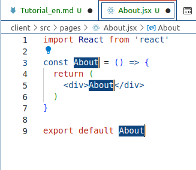

# Building a secure and trustworthy Web3 Crowdfunding Platform with QuickNode, Solidity, Orbis Protocol and verifiable credentials.

#### vous pouvez aussi lire ce tutoriel en français ici: [Créer une plateforme de financement participatif Web3 sécurisée et digne de confiance avec QuickNode, Solidity, le Protocol Orbis et les informations d'identification vérifiables](./Tutorial_fr.md "Version française")


Table of Contents<br>
[part 1 the starting point and the base of the  contract](#starting-the-app)<br>
[part 2 The client side of thing](#creating-the-app)<br>
[part 3 Enabling web3 within the app using context](#context-and-web3)<br>


## Introduction 

Welcome to this tutorial on building a secure and trustworthy web3 crowdfunding platform using QuickNode, React, Solidity, the Orbis Protocol.

In this tutorial, you will learn how to create a full-fledged web3.0 application that allows users to send transactions through the blockchain to support crowdfunding campaigns. We will use React to build the frontend of the platform, and Solidity to write smart contracts on the Ethereum network that handle web3 functionality. To connect the platform to the Ethereum network, we will use QuickNode. Additionally, we will use the Orbis Protocol to add social features such as a newsfeed, messaging, and the ability to follow other users.

To ensure the security and reputation of our platform and its users, we will also be implementing the W3C Verifiable Credentials protocol by orbis. These tools will allow us to validate campaign creators and use verifiable credentials to ensure the integrity of our platform.

I am excited to guide you through using these tools and technologies to build a secure, trustworthy platform that also includes social features. Let's get started on creating an amazing web3 crowdfunding platform together!

**I hope you're as excited as I'm to get started on this tutorial! Let's dive in and start building our web3 crowdfunding platform.**


### Why a web3 crowdfunding platform? 

* Decentralization: Web3 platforms are decentralized, which means that they are not controlled by a single entity or authority. This can help to ensure that the platform is fair and transparent, as decisions are made through consensus rather than by a centralized authority.

* Security: Web3 platforms can be more secure than traditional platforms, as they use blockchain technology to store and secure data. This can help to prevent fraud and tampering, which can be a concern with traditional platforms.

* Accessibility: Web3 platforms can be accessed by anyone with an internet connection, which means that they can be used by a wider range of people than traditional platforms that may be limited to certain regions or countries.

* Inclusivity: Web3 platforms can also be more inclusive, as they can allow users to participate using a variety of web3 payment methods such as cryptocurrencies. This can make it easier for people who may not have access to traditional financial services to participate in crowdfunding campaigns.

* Transparency: Web3 platforms can also be more transparent, as they use blockchain technology to track and record transactions. This can make it easier for users to see how their donations are being used and can help to build trust within the community.

### Why a reputation passport?

* Security: One of the main benefits of using a reputation passport is that it can help to ensure the security of the platform. By verifying the identity and reputation of campaign creators, users can have confidence that they are supporting legitimate campaigns and not falling victim to scams or fraud.

* Trustworthiness: A reputation passport can also help to build trust within the community by allowing users to see the reputation and feedback of other users. This can help users make informed decisions about which campaigns to support and can encourage more people to participate in the platform.

* Incentives: A reputation passport can also create incentives for campaign creators to behave ethically and maintain a good reputation.
  This can help to ensure that campaigns are run fairly and transparently, which can further enhance the trustworthiness of the platform.

* Community: A web3 crowdfunding platform with social features can help to build a sense of community among users, which can be a valuable asset for both campaign creators and donors. By allowing users to connect with each other and discuss their campaigns, the platform can become a hub of activity and engagement.

**Overall, building a web3 crowdfunding platform with a reputation passport can be a good thing because it can offer a decentralized, secure, accessible, inclusive, trustworthy, social and transparent environment for crowdfunding activities. <br>This can help to make crowdfunding more efficient, effective, building confidence in the platform and encourage more people to participate, which can ultimately lead to more successful campaigns and a stronger community.**

## Prerequisites

1. Basic understanding of web development concepts such as HTML, CSS, and JavaScript.

2. Experience with React: None as we start from scratch, but it may be helpful to have some familiarity with this framework.

3. Experience with Solidity: you may need some familiarity with this programming language.

4. Experience with the terminal: Some parts of the tutorial may involve using command line to install dependencies or run commands, so you may need some familiarity with it.

## Setting up your development environment

Before we get started, we need to set up our development environment. 

### QuickNode

First, we will use QuickNode to spin up an Ethereum node with just a few clicks. 
This will give us access to the Ethereum evm and networks and all of its features.

QuickNode is a service that allows you to spin up a node in just a few clicks. It is a great way to get started with Ethereum development, as it allows you to quickly set up a node and start building your application without having to worry about setting up a node from scratch (which is ressource and time consuming).
To create a node you need to register an account on QuickNode and then create a node for the network of your choice they can help you with at least 16 different blockchains at the time of writing this.

Boot your QuickNode in seconds and get access to 16+ different chains. Their globally distributed, auto-scaling, multi-cloud network will carry you from MVP all the way to enterprise. [QuickNode signup](https://www.quicknode.com/signup "QuickNode") 


MVP stands for Minimum Viable Product. In this context, it refers to a stage in the development process where the product has the minimum set of features necessary 

to be functional and can be used to test and validate the concept with potential customers. 
The idea is to get the product to market as quickly as possible in order to gather feedback and iterate on the product before investing too much time and resources 

into development. The goal is to get the product to the point where it can be used to demonstrate its value and attract funding or customers.


### Recommended IDE

I recommend using VS Code as your IDE. It is a lightweight, open-source code editor that is easy to use and has a lot of useful features. It also has a lot of extensions that can help you with your development, such as Solidity and React.

### the basic structure of our project

we will be using the following structure for our project:
co we create the Crowdfunding_tutorial folder and inside it we create the client and web3 folders. The client folder will contain the frontend of our application, and the web3 folder will contain the smart contracts and the backend of our application.


```javascript
=> Crowdfunding_tutorial
  => client
  => web3
    
```
### starting the App

open up the crowdfunding_tutorial folder in VS Code and open a new terminal. 


in the terminal at the root level of your project, run the following command to create the smart contract of our application:

```bash
npx thirdweb@latest create --contract
```


and you can make different commands like this:


now we have some files in our web3 folder, let's take a look at them:


You can start editing the page by modifying contracts/Contract.sol.

To add functionality to your contracts, you can use the @thirdweb-dev/contracts package which provides base contracts and extensions to inherit. Head to thirdweb  [Contracts Extensions Docs](https://portal.thirdweb.com/contractkit) to learn more.

as we need to manage sensible data in our smart contract, we will use the dotenv package to store our private key and mnemonic phrase in a .env file.
  
  ```bash
  $ npm install dotenv
  ```
  


we begin and rename the file contracts/Contract.sol to contracts/MyCrowdfunding.sol and we will start editing it.

we use [https://docs.soliditylang.org/en/v0.8.17/introduction-to-smart-contracts.html](https://docs.soliditylang.org/en/v0.8.17/introduction-to-smart-contracts.html) as a reference for solidity.

### saving some gas

And we have at heart that our users will be able to create campaigns, donate to campaigns, and withdraw funds from campaigns, without paying too much gas.

Because programming in solidity insn't really like programming in other languages, we will start with the basics and then we will add more features to our smart contract. some parts of the code will be revisited later in the tutorial, for optimisation purpose.
but one thing we can do now is thinking about the data structure we will need to store in our smart contract.

Because we will need to store the data of our campaigns, we need to create a structure, and we call it Campaign.
and here is the first way where we can optimise our code, we will use what is call a tight packing, which means that we will use the smallest data type possible for each variable, and empile them in the right order to save gas for storagage data ONLY in memory packing data cost you more!

default slot length in solidty is 32 bytes, and the default unit of memory and storage is 32 bytes.
in a 32 bytes slot we can save a uint256, which is the biggest integer type in solidity, but we can also save 8 uint32, 4 uint64, 2 uint128, or 1 uint256.
Thus a uint8 is 1 byte, a uint16 is 2 bytes, a uint32 is 4 bytes, a uint64 is 8 bytes, a uint128 is 16 bytes, a uint160 is 20 bytes  and a uint256 is 32 bytes.

Thinking a little about the value we have to store and the range they may have, will help us to take the fee as low as possible, this is also a valuable skill to have when you are programming in solidity.

### The smart contract

we will start by declaring the version of solidity we will use, and the compiler version we will use to compile our smart contract.
Next the first variable is an address it is the campaign owner. (or the admin of the platform if you want to think about it that way).

An address in solidity is a 20 bytes variable which is a uint160, it means that it will take 20 bytes of memory of storage in one slot of 32 bytes, as the base unit of memory and storage in solidity is 32 bytes. so the compiler can intelligently pack the data in the right order to save gas.

It does it by completing the 32 bytes slot with 0, so the address will take 20 bytes and the other 12 bytes will be 0 or we can use the 12 bytes to store another variables. and we will do that. simply by declaring the right type and packing them in the right order.
saving space in storage in solidity is really important, because it will save gas for the user.

into the MyCrowdfunding.sol file we will add the following code:

```javascript
// SPDX-License-Identifier: GPL-3.0
pragma solidity ^0.8.17;

/**
 * @title MyCrowdfunding
 * @author Timothee de Almeida < [tim@1proamonservice.eu] >
 * @dev Implements crowdfunding platform
 * @dev This contract is a simple crowdfunding platform where users can create campaigns and other users can donate to them.
 * 
 */

contract MyCrowdfunding {
// platform owner address admin of the platform
    address public platformOwner;

}//end of contract
```

#### different data structures

Then we declare the backer data structure which will hold the data of the backers and donations of each crowdfunding campaign.
and we tight pack the data in the right type and order to save gas.

As we know that the address is a uint160 which take 20 bytes of the 32 bytes of the current slot, we will declare the backer variable of type address, and the donation variable of type uint88, which is a uint of 88 bits so it make 11 bytes of memory or storage in one slot of 32 bytes. as a total of 31 bytes of memory or storage in one slot of 32 bytes. (we are sure that this structure will never take more than 31 bytes of memory or storage).


```javascript
// backer data structure
    struct BackerData {
        address backer;
        uint88 donation;
    }
```


Then we declare the campaign structure which will hold all the campaign data.

* The campaign owner variable will be of type address, and it will hold the address of the campaign owner.(20 bytes of 1 slot of 32 bytes).
* An uint64 is enough to store a timestamp until the year 584,554AD so enough isn't (8 bytes of 1 slot of 32 bytes).
* status is a uint8 (255 possible values) so it is enough to store the status of the campaign (1 byte of 1 slot of 32 bytes).
    * 0 - draft
    * 1 - active
    * 2 - completed
    * 3 - cancelled
    * 4 - withdrawn
    * 5 - refunded campaign failed
    * 6 - expired
    * 7 - partial withdrawal

We have used only 1 slot of 32 bytes to store the 3 variables above. and we have 3 bytes left in this slot.
So if needed later we could use this space to store another variables bool for example(1byte) or uint24(3bytes), etc.    

* We use uint128 to store the target and amountCollected variables, which are enough to store a value of 340,282,366,920,938,463,463,374,607,431,768,211,455 (16 bytes of 1 slot of 32 bytes each).

* we use a dynamic array of backersData structure to store the backers and donations of the campaign (32 bytes of 1 slot of 32 bytes). and 1 slot of 32 bytes for each line of backerData structure.

The next three line are string variables, which are dynamic array of bytes, so they take 32 bytes of memory or storage in one slot of 32 bytes, and 1 slot of 32 bytes for each character of the string. so their size is not fixed, and we can't really optimise them. hmm we will see it later but we can implement different ways to store these data in an efficient and optimised way.
So string for title, description and imageUrl..

you can read about the differents types of variables in solidity here: [https://docs.soliditylang.org/en/v0.8.17/types.html](https://docs.soliditylang.org/en/v0.8.17/types.html) 

so add the following code to the MyCrowdfunding.sol file below the backerData structure:

```javascript
// campaign structure which holds the campaign data
    struct Campaign {
        // campaign owner address (20 bytes of 1 slot of 32 bytes)
        address owner;
        // an uint64 is enough to store a timestamp until the year 584554 so it does take 8 bytes of 1 slot of 32 bytes
        uint64 deadline;  
       // campaign status
        // 0 - draft
        // 1 - active
        // 2 - completed
        // 3 - cancelled
        // 4 - withdrawn
        // 5 - refunded
        // 6 - expired
        //a uint8 is enough to store a status code, it takes 1 byte of 1 slot of 32 bytes
        uint8 status;

        // here we have used 1 slot so far and we have 3 byte left in the slot to store another variable.
        // we could use this space to store another variable bool for example(1byte) or uint24(3bytes), etc.  
        bool mutex;
        // target and amountCollected are uint128 enough to store a value of 340282366920938463463374607431768211455.
        uint128 target;        
        uint128 amountCollected;
        // from now we are using 1 slot or more per variable.
        // backersData array is a dynamic array of BackerData structure    1 slot of 32 bytes for the array and 1 slot of 32 bytes for each line of BackerData structure.
        BackerData[] backersData;

        //these string are dynamic and will take more than 1 slot of 32 bytes each.
        string image;
        string title;
        string description;        
    }

```
we will see later how to optimise the storage of the string variables.

Then we declare the campaigns mapping which will hold all the campaigns of the platform, using numberOfCampaigns as index.

so we add the following code to the MyCrowdfunding.sol file below the Campaign structure:

```javascript

  // mapping of campaign IDs to campaign data
    mapping(uint => Campaign) public campaigns;
    // number of campaigns
    uint public numberOfCampaigns;
    
```
#### Events
So  now is a good time to talk about the events and how to use them.
Events in solidity are a way to notify the blockchain that something has happened in the contract.
and it can be used in front-end to listen to the event and do something when the event is triggered, like updating the UI with new data and the new state of the contract.


in our contract we will use events to notify the blockchain that a new campaign has been created or it's status has been modified, or that a new donation has been made to a campaign.

So we will add the following code to the MyCrowdfunding.sol file below the campaigns mapping:

```javascript

// events
    event CampaignCreated(uint _campaignId, address _owner, uint _target, uint _deadline);
    event CampaignStatusChanged(uint _campaignId, uint _status);
    event DonationReceived(uint _campaignId, address _backer, uint _amount);
   
```
#### CustomErrors
I recommand you to read this portion of the doc [Events documentation](https://docs.soliditylang.org/en/v0.8.17/contracts.html#events "Events documentation")
we will see later how to use the events in the front-end, and come back to this part of the code as we add others events in our contract.

Since solidity 0.8.4 we can use CustomErrors to throw errors in our contract, and it is a good practice to use them instead of the require function.
It is a good practice to use CustomErrors because 

1) it save bytecode space  
2) it is more gas efficient  
3) it is easier to debug the contract.

you'll find more informations about custom errors here: [revert statement documentation](https://docs.soliditylang.org/en/latest/control-structures.html#revert-statement "revert statement  documentation") 

and [error documentation](https://docs.soliditylang.org/en/v0.8.17/contracts.html#index-16 "error function documentation") 

We declare  custom errors, and we will use them in our contract to throw errors.

**require(condition, "error message") should be translated to if (!condition) revert CustomError().**

So we will add the following code to the MyCrowdfunding.sol file below the events declaration:

```javascript
error Unauthorized(address caller);
error DeadlineError(uint deadline);
error CampaignStatusError(uint status);
```

#### Constructor

The constructor function is a special function that is executed only once when the contract is deployed.
In our case we will use it to set the platformOwner variable to the address that deployed the contract.


Now we will add the constructor function to the MyCrowdfunding.sol file below the events declaration:

```javascript

 //basic functions
    constructor() {
        platformOwner = msg.sender;
        
    }
```

#### contract functions

Now it's time to add the functions that will be used in our contract<br>
to create a campaign,<br> donate to a campaign, etc.<br>
we begin with the createCampaign function.<br>

function createCampaign (<br>
  address _owner, <br>
  string memory _title, <br>
  string memory _description,<br> 
  uint256 _target, <br>
  uint256 _deadline, <br>
  string memory _image <br>
  )  public returns (uint256) {}<br>

This function will be called by the campaign owner and will set a new campaign with all the data passed as parameters.
These parameters will be stored in the campaigns[numberOfCampaigns] array of struct Campaign.

They are declared as **storage** variables and packed in the datastructure Campaign.

when we have set the data in the campaign structure, we update the numberOfCampaigns variable and<br>
we emit the CampaignCreated event to notify the blockchain that a new campaign has been created.<br>
Next we return the id of the campaign (which is now the value of numberOfCampaigns-1).

So we will add the following code to the MyCrowdfunding.sol file below the constructor function:

```javascript
//@dev create a new campaign, will be called by the campaign owner and will be revisited later
    function createCampaign (address _owner, string memory _title, string memory _description, uint256 _target, uint256 _deadline, string memory _image)  public returns (uint256) {
        Campaign storage campaign = campaigns[numberOfCampaigns];
        // we have to use storage here because we are modifying the campaign data
        // we check if deadline is in the future if not we throw an error DeadlineError(uint deadline)
        if(_deadline <= block.timestamp) revert DeadlineError(_deadline);        
        campaign.owner = _owner;
        campaign.deadline = uint64(_deadline);
        campaign.status = 1;
        campaign.target = uint128(_target);
        campaign.amountCollected = 0;
        campaign.image = _image;
        campaign.title = _title;
        campaign.description =_description;                               
        numberOfCampaigns++;
        emit CampaignCreated(numberOfCampaigns-1, _owner, _target, _deadline);
        return numberOfCampaigns-1;
    }
```

Now we have a function to create a campaign, but we need a function to donate to a campaign too.

```javascript

function donateToCampaign (uint256 _id) public payable {
      uint256 amount= msg.value;
      Campaign storage campaign = campaigns[_id];
      // we check if deadline is in the future if not we throw an error DeadlineError(uint deadline)
        if(campaign.deadline <= block.timestamp) revert DeadlineError(campaign.deadline);
        // we check if the campaign is active if not we throw an error CampaignStatusError(uint status)
        if(campaign.status != 1) revert CampaignStatusError(campaign.status);      
          BackerData memory backerData = BackerData({
              backer: msg.sender,
              donation: uint88(amount)
          });
          campaign.backersData.push(backerData);
          campaign.amountCollected = uint128(campaign.amountCollected+amount);
          emit DonationReceived(_id, msg.sender, amount);
          if(campaign.amountCollected >= campaign.target) {
            // if the campaign has reached the target we change the status to 2
            campaign.status = 2;
            // we emit the CampaignStatusChanged event to notify the blockchain that the campaign status has been changed
            emit CampaignStatusChanged(_id, 2);
        }
      
    }

```

 we add the getCampaigns and getDonators functions to the contract.<br>
 Into the MyCrowdfunding.sol file below the createCampaign function:

```javascript

function getDonators (uint256 _id) view public returns (BackerData[] memory) {
      Campaign storage campaign = campaigns[_id];
      return campaign.backersData;
    }

    function getCampaigns () public view returns (Campaign[] memory)  {
        uint _numberOfCampaigns = numberOfCampaigns;
        Campaign[] memory allCampaigns = new Campaign[](_numberOfCampaigns);
        for (uint i=0; i<_numberOfCampaigns; i++) {
            Campaign storage item = campaigns[i];
            Campaign memory campaign = Campaign({
                owner: item.owner,
                deadline: item.deadline,
                status: item.status,
                target: item.target,
                amountCollected: item.amountCollected,
                backersData: item.backersData,
                image: item.image,
                title: item.title,
                description: item.description
            });
            allCampaigns[i] = campaign;
        }
        return allCampaigns;
    
    }

```

we now add a withdraw function to the contract this one will introduce some new concept and modify some sections previously written, in fact :
we add to the campaign structure a new variable called mutex which will be used to prevent reentrancy attacks.

we add it in the campaign structure remember we have 3 byte left in the beginning of the struct there insert the bool mutex variable that 1 byte more in the slot and  we need to add in the createCampaign function.
as well as a new variables called amountWithdrawn that will be used to store the amount that had been withdrawn.
```javascript
    struct Campaign {
        // campaign owner address (20 bytes of 1 slot of 32 bytes)
        address owner;
        // an uint64 is enough to store a timestamp until the year 584554 so it does take 8 bytes of 1 slot of 32 bytes
        uint64 deadline;  
       // campaign status
        // 0 - draft
        // 1 - active
        // 2 - completed
        // 3 - cancelled
        // 4 - withdrawn
        // 5 - refunded
        // 6 - expired
        //a uint8 is enough to store a status code, it takes 1 byte of 1 slot of 32 bytes
        uint8 status;

        // here we have used 1 slot so far and we have 3 byte left in the slot to store another variable.
        // we could use this space to store another variable bool for example(1byte) or uint24(3bytes), etc. 
        // but we will use it to store a bool variable called mutex which will be used to prevent reentrancy attacks. 
        bool mutex; 

        //this is 1 of 3 bytes left in the slot so 2 free bytes left

        // target and amountCollected are uint128 enough to store a value of 340282366920938463463374607431768211455.
        uint128 target;        
        uint128 amountCollected;
        uint128 amountWithdrawn;

```
this mean we have to modify the createCampaign function to add the mutex variable to the campaign structure.
so add this line campaign.mutex = false; in the createCampaign function.
below the campaign.status = 1; line.
so it will look like this:

```javascript
//@dev create a new campaign, will be called by the campaign owner and will be revisited later
    function createCampaign (address _owner, string memory _title, string memory _description, uint256 _target, uint256 _deadline, string memory _image)  public returns (uint256) {
        
        // we check if deadline is in the future if not we throw an error DeadlineError(uint deadline)
        if(_deadline <= block.timestamp) revert DeadlineError(_deadline);    
        Campaign storage campaign = campaigns[numberOfCampaigns];
        // we have to use storage here because we are modifying the campaign data
        campaign.owner = _owner;
        campaign.deadline = uint64(_deadline);
        campaign.status = 1;
        campaign.mutex = false;
        campaign.target = uint128(_target);
        campaign.amountCollected = 0;
        campaign.amountWithdrawn = 0;
        campaign.image = _image;
        campaign.title = _title;
        campaign.description =_description;                               
        numberOfCampaigns++;
        emit CampaignCreated(numberOfCampaigns-1, _owner, _target, _deadline);
        return numberOfCampaigns-1;
    }
```

we will also add a new event in the event section called Withdrawal to notify the blockchain that a withdrawal has been made.

```javascript
event Withdrawal(uint256 indexed _campaignId, address indexed _owner, uint256 _amount, uint256 _timestamp);
```

we will also add these new errors to the contract in the error section.

```javascript
    error LockError();
    error TransferError(uint campaignId, uint amount, address recipient);
    error InvalidWithdrawValue(uint _request, uint _available);
```
we have to alter the donate function to add the paritially withdrawn status to the campaign.status test in the beginning of the function. as with the withdraw function we will use a new status that is partially withdrawn to indicate that the campaign has been partially withdrawn. look at the if statement with campaign.status


so now the donateToCampaign functions will look like this:
```javascript
function donateToCampaign (uint256 _id) public payable {
      uint256 amount= msg.value;
      Campaign storage campaign = campaigns[_id];
      // we check if deadline is in the future if not we throw an error DeadlineError(uint deadline)
        if(campaign.deadline <= block.timestamp) revert DeadlineError(campaign.deadline);
        // we check if the campaign is active if not we throw an error CampaignStatusError(uint status)
        if(campaign.status != 1 && campaign.status !=7) revert CampaignStatusError(campaign.status);      
          BackerData memory backerData = BackerData({
              backer: msg.sender,
              donation: uint88(amount)
          });
          campaign.backersData.push(backerData);
          campaign.amountCollected = uint128(campaign.amountCollected+amount);
          emit DonationReceived(_id, msg.sender, amount);
          if(campaign.amountCollected >= campaign.target) {
            // if the campaign has reached the target we change the status to 2
            campaign.status = 2;
            // we emit the CampaignStatusChanged event to notify the blockchain that the campaign status has been changed
            emit CampaignStatusChanged(_id, 2);
        }
      
    }

```
we will add also a new status to the platform to indicate that the platform is in emergencyStop mode.
in the beginning of the contract just below the platformowner address declaration 
we will add a new variable called _emergencyStop of type bool.
```javascript
 
bool public _emergencyStop;

```

we will also add a new error to the contract in the error section.

```javascript
    error EmergencyMode();
```
we will add an event to notify the blockchain that the emergencyStop mode has been changed.
```javascript
    event EmergencyStopChanged(address indexed admin, bool value, uint timestamp);
```

we will add a new function to the contract to allow the platform owner to activate the emergencyStop mode.
```javascript
         //@dev function to stop all actions on the platform
        function emergencyStop() public {
            // only platform owner or emergency contact can call this function
            if (msg.sender == platformOwner ||  emergencyContacts[msg.sender] == true) {
                _emergencyStop = true;
            }
        }
```
we will also add a new function to the contract to allow the platform owner to resume normal operations on the platform.
so we need to add a constant variable to the contract to set the minimum interval between two resume operations.
```javascript
        uint constant MIN_RESUME_INTERVAL = 5 minutes;
```
```javascript
        //@dev function to resume normal operations on the platform
        function resume() public {
            // only platform owner or emergency contact can call this function
            if (msg.sender == platformOwner || emergencyContacts[msg.sender] == true) {
                // add a delay or lock-out period to prevent frequent or abusive use
                if (block.timestamp > lastResumeTimestamp + MIN_RESUME_INTERVAL) {
                    _emergencyStop = false;
                    lastResumeTimestamp = block.timestamp;
                }
            }
        }
```

we will also add a new function to the contract to allow the platform owner to add an emergency contact and one to remove it.
```javascript
        //@dev function to add an address to the emergencyContacts mapping
        function addEmergencyContact(address _contact) public {
            //we check if emergency mode is on
            if(_emergencyStop) revert EmergencyMode();
            // only platform owner can call this function
            if (msg.sender == platformOwner) {
                emergencyContacts[_contact] = true;
            }
        }
           //@dev function to remove an address to the emergencyContacts mapping
        function removeEmergencyContact(address _contact) public {
            //we don't check if emergency mode is on in this case it could be better to let the owner remove an emergency contact even if the platform is in emergency mode, maybe this emergency contact is not available anymore or he is responsible of the emergency..
            
            // only platform owner can call this function
            if (msg.sender == platformOwner) {
                emergencyContacts[_contact] = false;
            }
        }
```

Our user need a way to withdraw the funds from a campaign in multiple conditions and times.

We add a special mapping lastWithdrawalTimestamp in the mapping section of the contract.

This mapping will be used to store the last withdrawal timestamp that the owner of the campaign has made, so we use a mapping inside a mapping to store the timestamp of the last withdrawal for each campaign and each owner.
we will add this mapping:

```javascript
//last withdraw activity mapping(campaignId=> mapping(address"WHO" => timestamps))
    mapping(uint => mapping(address => uint)) public lastWithdrawalTimestamp;
```  

into the MyCrowdfunding.sol file below the getCampaigns function:

```javascript
  function withdraw(uint256 _id, uint256 _amount) public {
        //we check if platform emergency mode is on
        if(_emergencyStop) revert EmergencyMode();
        Campaign storage campaign = campaigns[_id];
        // we check the mutex lock for this campaign and verify if it is on
        if(campaign.mutex) revert LockError();
        //we check if campaign emergency mode is on
        if(campaign.status==255) revert EmergencyMode();        
        if (campaign.owner != msg.sender) revert Unauthorized(msg.sender);
        uint _available= campaign.amountCollected-campaign.amountWithdrawn;
        
        // Acquire the mutex lock for this campaign
        campaign.mutex=true;       
        uint status=campaign.status;
        if (status != 1 && status != 2 && status != 7) revert CampaignStatusError(status);
        if (_amount > _available) revert InvalidWithdrawValue(_amount,_available);
        campaign.amountWithdrawn += uint128(_amount);
        // Transfer the Ether to the campaign owner
        (bool success, ) = (msg.sender).call{value: _amount}("");
        if (!success) {
        revert TransferError(_id, _amount, msg.sender);
        }
        emit Withdrawal(_id, msg.sender, _amount, block.timestamp);
        // If the campaign has been fully withdrawn but has not reached its target, set the campaign status to "partially withdrawn 7"
        if (campaign.amountWithdrawn == campaign.amountCollected && campaign.amountCollected < campaign.target) {
            campaign.status = 7;
            emit CampaignStatusChanged(_id, 7);
        } 
        // If the campaign has reached its target and all funds have been withdrawn, set the campaign status to "withdrawn 4"       
        else if ( campaign.amountCollected >= campaign.target && campaign.amountWithdrawn == campaign.amountCollected) {
            campaign.status = 4;
            emit CampaignStatusChanged(_id, 4);
        }
        // Update the last withdrawal timestamp for this campaign and address
        lastWithdrawalTimestamp[_id][msg.sender] = block.timestamp;
        // Release the mutex lock for this campaign

        campaign.mutex = false;

        } 

```
So there is some things to be said here :

* the withdraw function take 2 arguments the campaign id and the amount to withdraw.

* first we check if emergency mode is on
        
if(_emergencyStop) revert EmergencyMode();

* The function retrieve campaign data in a structure of type Campaign we use storage as we will modify it 

Campaign storage campaign = campaigns[_id];


* Then we check if the campaign emergency mode is on (different from platform emergency mode)

if(campaign.status==255) revert EmergencyMode();

* Then it retrieve the value that is available to withdraw in a variable called _available by subtracting the amount collected from the amount withdrawn, this is to 
make sure that the owner of the campaign can't withdraw more than what is available, and doing it before the lock is acquired prevent race condition.

uint _available= campaign.amountCollected-campaign.amountWithdrawn;

* Then it acquire the mutex lock for this campaign and verify if it is on if it is it will throw an error LockError()

if(campaign.mutex) revert LockError(); and then it set the mutex to true to lock the campaign
campaign.mutex=true;

* Then it check if the caller is the owner of the campaign if not it will throw an error Unauthorized(address)

if (campaign.owner != msg.sender) revert Unauthorized(msg.sender);

* Then it check if the campaign status is 1,2 or 7 if not it will throw an error CampaignStatusError(uint)

if (status != 1 && status != 2 && status != 7) revert CampaignStatusError(status);

* Then it check if the amount to withdraw is greater than the available amount if it is it will throw an error InvalidWithdrawValue(_amount,_available)

if (_amount > _available) revert InvalidWithdrawValue(_amount,_available);

* Then it add the amount to withdraw to the amount withdrawn in the campaign structure

campaign.amountWithdrawn += uint128(_amount);

* Then it try to transfer the amount to the owner of the campaign if it fails it will throw an error TransferError(uint campaignId,uint amount,address msg.sender)

// Transfer the Ether to the campaign owner

        (bool success, ) = (msg.sender).call{value: _amount}("");

        if (!success) {
        revert TransferError(_id, _amount, msg.sender);
        }


* Then it emit the Withdrawal event to notify the blockchain that a withdrawal has been made

emit Withdrawal(_id, msg.sender, _amount, block.timestamp);


* Then it check if the campaign status is not 7 and the amount withdrawn is less than the target if it is it will change the status to 7 and emit the CampaignStatusChanged event to notify the blockchain that the status has been changed  7 is partially withdrawn

if (campaign.amountWithdrawn == campaign.amountCollected && campaign.amountCollected < campaign.target) {
        campaign.status = 7;
        emit CampaignStatusChanged(_id, 7);
        }

* Then it check if the amount collected is greater than or equal to the target and the amount withdrawn is equal to the amount collected if it is it will change the status to 4 and emit the CampaignStatusChanged event to notify the blockchain that the status has been changed 4 is withdrawn and 7 is partially withdrawn 
  
  else if ( campaign.amountCollected >= campaign.target && campaign.amountWithdrawn == campaign.amountCollected) {
          campaign.status = 4;
          emit CampaignStatusChanged(_id, 4);
          }

* Update the last withdrawal timestamp for this campaign and address

lastWithdrawalTimestamp[_id][msg.sender] = block.timestamp;

* The last thing it does is releasing the mutex lock for this campaign.

campaign.mutex = false;
}

This close the withdraw function, we will now add some functions and events verify in the complete code as nothing new to the contract to make it more usable and safe.

```javascript
         //@dev function to stop normal operations on the campaign
        function setCampaignEmergencyStop (uint _campaignId) public {
            //we didn't check if platform emergency mode is on because admin may have to set emergency stop on campaign to resume normal platform operation
            Campaign storage campaign = campaigns[_campaignId];
            //we check if msg.sender is platformOwner or emergencyContacts
            if(msg.sender != platformOwner && !emergencyContacts[msg.sender] && msg.sender != campaign.owner) revert Unauthorized(msg.sender);
           
            
            //we set the campaign status to 255 it is the panic mode emergency stop value of status if yes we revert no need to set already set
            if(campaign.status == 255) revert CampaignEmergencyMode("campaign already in emergency mode");
            campaign.backupStatus=campaign.status;
            campaign.status=255;
            emit CampaignEmergencyStopChanged(_campaignId, msg.sender, true, block.timestamp);
        }
         //@dev function to resume normal operations on the campaign
        function campaignResume(uint _campaignId) public {
            // only platform owner or emergency contact can call this function
            if(msg.sender != platformOwner && !emergencyContacts[msg.sender]) revert Unauthorized(msg.sender);
            //we set the campaign back to backupstate it is the panic mode emergency OFF  status
            Campaign storage campaign = campaigns[_campaignId];
             if(campaign.status != 255) revert CampaignEmergencyMode("campaign not in emergency mode");            
            campaign.status=campaign.backupStatus;   
            emit CampaignEmergencyStopChanged(_campaignId, msg.sender, false, block.timestamp);         
        }


        function cancelCampaign(uint256 _campaignId) public {
            // Get the campaign data
            Campaign storage campaign = campaigns[_campaignId];
            // Check that the caller is a platform admin or the campaign owner
            if(msg.sender != platformOwner && !emergencyContacts[msg.sender] &&  msg.sender != campaign.owner) revert Unauthorized(msg.sender);
            
            // Check that the campaign is still active or partial withdrawn or emergency stop mode
            uint status=campaign.status;
            if (status != 1 && status != 7 && status != 255) revert CampaignStatusError(status);
            //we restrict if campaign.owner == msg.sender
            if(msg.sender==campaign.owner) {
                if (status==255) {
                    emit CancelPending(_campaignId, msg.sender, block.timestamp);
                   return ;
                }
                if(status==7){
                    if(lastWithdrawalTimestamp[_campaignId][msg.sender] > block.timestamp - MIN_CANCEL_INTERVAL){
                        emit SpeedCancelAlert(_campaignId,msg.sender,block.timestamp);
                    }
                    campaign.backupStatus=campaign.status;
                    campaign.status=255;
                    emit CampaignEmergencyStopChanged(_campaignId, msg.sender, true, block.timestamp);
                    emit CancelPending(_campaignId, msg.sender, block.timestamp);
                    return ;
                }
            }
            
            // Set the campaign status to "cancelled"
            campaign.status = 3;
            // Emit an event to record the change in status
            emit CampaignStatusChanged(_campaignId, 3);
            return ;
        }

        function partialRefund(uint campaignId) public {

            // only platform owner or emergency contact can call this function
            if(msg.sender != platformOwner && !emergencyContacts[msg.sender]) revert Unauthorized(msg.sender);
            Campaign storage campaign = campaigns[campaignId];
            if (campaign.amountWithdrawn == campaign.amountCollected) {               
                return; // nothing to do
            }

            uint refundAmount = campaign.amountCollected - campaign.amountWithdrawn;
            uint percentage = 100 * refundAmount / campaign.amountCollected;
            uint tmp=campaign.backersData.length;
            // we check the mutex lock for this campaign and verify if it is on
            if(campaign.mutex) revert LockError();
            campaign.mutex=true;
            //we give property of the refundamount to backers through this mapping 
            for (uint i = 0; i < tmp; i++) {
                BackerData storage backer = campaign.backersData[i];
                uint backerRefundAmount = backer.donation * percentage / 100;
                BackerRefund memory refundprocess = BackerRefund({
              locked: false,
              refundAmount: uint128(backerRefundAmount)
          });
                partialRefundWaiting[campaignId][backer.backer]=refundprocess;
                backer.donation -= uint88(backerRefundAmount);
                emit PartialRefundWaitingNotification(campaignId, backer.backer, block.timestamp);                
            }
            // we substract the refundAmount from the collectedAmount
            campaign.amountCollected -= uint128(refundAmount);
            emit CampaignPartialRefundInitiated(campaignId,block.timestamp);
            // we free the mutex
            campaign.mutex=false;

        }

        function backerRefundWithdraw(uint campaignId) public {
            //we check if emergency mode is on
            if(_emergencyStop) revert EmergencyMode();
            BackerRefund storage refundprocess = partialRefundWaiting[campaignId][msg.sender];
            if(refundprocess.locked) revert LockError();
            refundprocess.locked=true;
            if ( refundprocess.refundAmount > 0) {
                uint _amount=refundprocess.refundAmount;
                // Transfer the Ether to the campaign owner
                (bool success, ) = (msg.sender).call{value: _amount}("");
                if (!success) {
                    revert TransferError(campaignId, _amount, msg.sender);
                 }
                emit BackerRefundWithdrawn(campaignId, msg.sender, _amount, block.timestamp);
                delete partialRefundWaiting[campaignId][msg.sender];
            }

        }


```


### The full contract

```javascript 
// SPDX-License-Identifier: GPL-3.0
pragma solidity ^0.8.17;

/**
 * @title MyCrowdfunding
 * @author Timothee de Almeida < [tim@1proamonservice.eu] >
 * @dev Implements crowdfunding platform
 * @dev This contract is a simple crowdfunding platform where users can create campaigns and other users can donate to them.
 * 
 */

contract MyCrowdfunding {
    // platform owner address admin of the platform
    address public platformOwner;
    bool public _emergencyStop;
    uint constant MIN_RESUME_INTERVAL = 5 minutes;
    uint constant MIN_CANCEL_INTERVAL = 72 hours;
    uint private lastResumeTimestamp;
    // backer data structure
    struct BackerData {
        address backer;
        uint88 donation;
    }
     //in case of refund 
    struct BackerRefund{
        bool locked;
        uint128 refundAmount;
    }

    // campaign structure which holds the campaign data
    struct Campaign {
        // campaign owner address (20 bytes of 1 slot of 32 bytes)
        address owner;
        // an uint64 is enough to store a timestamp until the year 584554 so it does take 8 bytes of 1 slot of 32 bytes
        uint64 deadline;  
        // campaign status
        // 0 - draft
        // 1 - active
        // 2 - completed
        // 3 - cancelled
        // 4 - withdrawn
        // 5 - refunded
        // 6 - expired
        // 7 - partially withdrawn
        // 255 - panic stop mode (only set or unset by platform or secureContact
        //a uint8 is enough to store a status code, it takes 1 byte of 1 slot of 32 bytes
        uint8 status;

        // here we have used 1 slot so far and we have 3 byte left in the slot to store another variable.
        // we could use this space to store another variable bool for example(1byte) or uint24(3bytes), etc.  

        //that is what we do later in the contract explanation..
        bool mutex;
        uint8 backupStatus; //in  case of emergencystop
        //there is now 1 byte free in this slot

        // target and amountCollected are uint128 enough to store a value of 340282366920938463463374607431768211455.
        uint128 target;        
        uint128 amountCollected;
        uint128 amountWithdrawn;
        // from now we are using 1 slot or more per variable.
        // backers array is a dynamic array of backersData structure    
        BackerData[] backersData;

        //these string are dynamic and will take more than 1 slot of 32 bytes each.
        string image;
        string title;
        string description;        
    }
    // mapping of campaign IDs to campaign data
    mapping(uint => Campaign) public campaigns;
    mapping(uint => address) public campaignOwner;
    //mapping mergency contact
    mapping(address => bool) public emergencyContacts;
    // number of campaigns
    uint public numberOfCampaigns;
    //last withdraw activity campaign & address => timestamps
    mapping(uint => mapping(address => uint)) public lastWithdrawalTimestamp;
    //mapping for partialrefund mapping (capaignId=>mapping(donatorAddress=>BackerRefund))
    mapping(uint => mapping (address=>BackerRefund)) public partialRefundWaiting;

    // events
    event CampaignCreated(uint indexed _campaignId, address indexed _owner, uint _target, uint _deadline);
    event CampaignStatusChanged(uint indexed _campaignId, uint _status);
    event DonationReceived(uint indexed _campaignId, address indexed _backer, uint _amount);
    event Withdrawal(uint256 indexed _campaignId, address indexed _owner, uint256 _amount, uint256 _timestamp);
    event EmergencyStopChanged(address indexed admin, bool value, uint timestamp);
    event CampaignEmergencyStopChanged(uint indexed campaingId, address indexed admin, bool value, uint timestamp);
    event SpeedCancelAlert(uint indexed campaignId,address indexed campaignOwner,uint timestamp);
    event CancelPending(uint indexed campaignId,address indexed campaignOwner,uint timestamp);
    event PartialRefundWaitingNotification(uint indexed campaignId, address indexed backer, uint timestamp);
    event CampaignPartialRefundInitiated(uint campaignId, uint timestamp);
    event BackerRefundWithdrawn(uint indexed campaignId,address indexed backer , uint amount, uint timestamp);
    //Customerrors
    error Unauthorized(address caller);
    error DeadlineError(uint deadline);
    error CampaignStatusError(uint status);
    error LockError();
    error TransferError(uint campaignId, uint amount, address recipient);
    error InvalidWithdrawValue(uint _request, uint _available);
    error EmergencyMode();
    error CampaignEmergencyMode(string message);

    //basic functions
    constructor() {
        platformOwner = msg.sender;
        
    }


    //@dev create a new campaign, will be called by the campaign owner and will be revisited later
    function createCampaign (address _owner, string memory _title, string memory _description, uint256 _target, uint256 _deadline, string memory _image)  public returns (uint256) {
        //we check if emergency mode is on
        if(_emergencyStop) revert EmergencyMode();
        // we check if deadline is in the future if not we throw an error DeadlineError(uint deadline)
        if(_deadline <= block.timestamp) revert DeadlineError(_deadline);    
        Campaign storage campaign = campaigns[numberOfCampaigns];
        // we have to use storage here because we are modifying the campaign data
        campaign.owner = _owner;
        campaign.deadline = uint64(_deadline);
        campaign.status = 1;
        campaign.mutex = false;
        campaign.backupStatus=1;
        campaign.target = uint128(_target);
        campaign.amountCollected = 0;
        campaign.amountWithdrawn=0;
        campaign.image = _image;
        campaign.title = _title;
        campaign.description =_description;
        campaignOwner[numberOfCampaigns]=_owner;                               
        numberOfCampaigns++;
        emit CampaignCreated(numberOfCampaigns-1, _owner, _target, _deadline);
        return numberOfCampaigns-1;
    }
    
    function donateToCampaign (uint256 _id) public payable {
        //we check if emergency mode is on
        if(_emergencyStop) revert EmergencyMode();
      uint256 amount= msg.value;
      Campaign storage campaign = campaigns[_id];
      // we check if deadline is in the future if not we throw an error DeadlineError(uint deadline)
        if(campaign.deadline <= block.timestamp) revert DeadlineError(campaign.deadline);
        // we check if the campaign is active if not we throw an error CampaignStatusError(uint status)
        if(campaign.status != 1 && campaign.status !=7) revert CampaignStatusError(campaign.status);      
          BackerData memory backerData = BackerData({
              backer: msg.sender,
              donation: uint88(amount)
          });
          campaign.backersData.push(backerData);
          campaign.amountCollected = uint128(campaign.amountCollected+amount);
          emit DonationReceived(_id, msg.sender, amount);
          if(campaign.amountCollected >= campaign.target) {
            // if the campaign has reached the target we change the status to 2
            campaign.status = 2;
            // we emit the CampaignStatusChanged event to notify the blockchain that the campaign status has been changed
            emit CampaignStatusChanged(_id, 2);
        }
      
    }


    function getDonators (uint256 _id) view public returns (BackerData[] memory) {
      Campaign storage campaign = campaigns[_id];
      return campaign.backersData;
    }

    function getCampaigns () public view returns (Campaign[] memory)  {
        uint _numberOfCampaigns = numberOfCampaigns;
        Campaign[] memory allCampaigns = new Campaign[](_numberOfCampaigns);
        for (uint i=0; i<_numberOfCampaigns; i++) {
            Campaign storage item = campaigns[i];
            Campaign memory campaign = Campaign({
                owner: item.owner,
                deadline: item.deadline,
                status: item.status,
                mutex: false,
                backupStatus:item.backupStatus,
                target: item.target,
                amountCollected: item.amountCollected,
                amountWithdrawn: item.amountWithdrawn,
                backersData: item.backersData,
                image: item.image,
                title: item.title,
                description: item.description
            });
            allCampaigns[i] = campaign;
        }
        return allCampaigns;
    }

    function getCampaignOwner (uint _campaignId) public view returns (address) {
        return campaignOwner[_campaignId];
    }


    function withdraw(uint256 _id, uint256 _amount) public {
        //we check if platform emergency mode is on
        if(_emergencyStop) revert EmergencyMode();
        Campaign storage campaign = campaigns[_id];
        // we check the mutex lock for this campaign and verify if it is on
        if(campaign.mutex) revert LockError();
        //we check if campaign emergency mode is on
        if(campaign.status==255) revert EmergencyMode();        
        if (campaign.owner != msg.sender) revert Unauthorized(msg.sender);
        uint _available= campaign.amountCollected-campaign.amountWithdrawn;
        
        // Acquire the mutex lock for this campaign
        campaign.mutex=true;       
        uint status=campaign.status;
        if (status != 1 && status != 2 && status != 7) revert CampaignStatusError(status);
        if (_amount > _available) revert InvalidWithdrawValue(_amount,_available);
        campaign.amountWithdrawn += uint128(_amount);
        // Transfer the Ether to the campaign owner
        (bool success, ) = (msg.sender).call{value: _amount}("");
        if (!success) {
        revert TransferError(_id, _amount, msg.sender);
        }
        emit Withdrawal(_id, msg.sender, _amount, block.timestamp);
        // If the campaign has been fully withdrawn but has not reached its target, set the campaign status to "partially withdrawn 7"
        if (campaign.amountWithdrawn == campaign.amountCollected && campaign.amountCollected < campaign.target) {
            campaign.status = 7;
            emit CampaignStatusChanged(_id, 7);
        } 
        // If the campaign has reached its target and all funds have been withdrawn, set the campaign status to "withdrawn 4"       
        else if ( campaign.amountCollected >= campaign.target && campaign.amountWithdrawn == campaign.amountCollected) {
            campaign.status = 4;
            emit CampaignStatusChanged(_id, 4);
        }
        // Update the last withdrawal timestamp for this campaign and address
        lastWithdrawalTimestamp[_id][msg.sender] = block.timestamp;
        // Release the mutex lock for this campaign

        campaign.mutex = false;

        } 

        //@dev function to stop all actions on the platform
        function emergencyStop() public {
            // only platform owner or emergency contact can call this function
            if(_emergencyStop) revert EmergencyMode();
            if (msg.sender == platformOwner ||  emergencyContacts[msg.sender] == true) {
                _emergencyStop = true;
                emit EmergencyStopChanged(msg.sender, true, block.timestamp);
            }
        }

        //@dev function to resume normal operations on the platform
        function resume() public {
            // only platform owner or emergency contact can call this function
            if (msg.sender == platformOwner || emergencyContacts[msg.sender] == true) {
                // add lock-out period to prevent abusive use
                if (block.timestamp > lastResumeTimestamp + MIN_RESUME_INTERVAL) {
                    _emergencyStop = false;
                    lastResumeTimestamp = block.timestamp;
                    emit EmergencyStopChanged(msg.sender, false, block.timestamp);
                }
            }
        }
        //@dev function to add an address to the emergencyContacts mapping
        function addEmergencyContact(address _contact) public {
            //we check if emergency mode is on
            if(_emergencyStop) revert EmergencyMode();
            // only platform owner can call this function
            if (msg.sender == platformOwner) {
                emergencyContacts[_contact] = true;
            }
        }
        //@dev function to remove an address to the emergencyContacts mapping
        function removeEmergencyContact(address _contact) public {
            //we don't check if emergency mode is on in this case it could be better to let the owner remove an emergency contact even if the platform is in emergency mode, maybe this emergency contact is not available anymore or responsible of the emergency..         
            // only platform owner can call this function
            if (msg.sender == platformOwner) {
                emergencyContacts[_contact] = false;
            }
        }
         //@dev function to stop normal operations on the campaign
        function setCampaignEmergencyStop (uint _campaignId) public {
            //we didn't check if platform emergency mode is on because admin may have to set emergency stop on campaign to resume normal platform operation
            Campaign storage campaign = campaigns[_campaignId];
            //we check if msg.sender is platformOwner or emergencyContacts
            if(msg.sender != platformOwner && !emergencyContacts[msg.sender] && msg.sender != campaign.owner) revert Unauthorized(msg.sender);
           
            
            //we set the campaign status to 255 it is the panic mode emergency stop value of status if yes we revert no need to set already set
            if(campaign.status == 255) revert CampaignEmergencyMode("campaign already in emergency mode");
            campaign.backupStatus=campaign.status;
            campaign.status=255;
            emit CampaignEmergencyStopChanged(_campaignId, msg.sender, true, block.timestamp);
        }
         //@dev function to resume normal operations on the campaign
        function campaignResume(uint _campaignId) public {
            // only platform owner or emergency contact can call this function
            if(msg.sender != platformOwner && !emergencyContacts[msg.sender]) revert Unauthorized(msg.sender);
            //we set the campaign back to backupstate it is the panic mode emergency OFF  status
            Campaign storage campaign = campaigns[_campaignId];
             if(campaign.status != 255) revert CampaignEmergencyMode("campaign not in emergency mode");            
            campaign.status=campaign.backupStatus;   
            emit CampaignEmergencyStopChanged(_campaignId, msg.sender, false, block.timestamp);         
        }


        function cancelCampaign(uint256 _campaignId) public {
            // Get the campaign data
            Campaign storage campaign = campaigns[_campaignId];
            // Check that the caller is a platform admin or the campaign owner
            if(msg.sender != platformOwner && !emergencyContacts[msg.sender] &&  msg.sender != campaign.owner) revert Unauthorized(msg.sender);
            
            // Check that the campaign is still active or partial withdrawn or emergency stop mode
            uint status=campaign.status;
            if (status != 1 && status != 7 && status != 255) revert CampaignStatusError(status);
            //we restrict if campaign.owner == msg.sender
            if(msg.sender==campaign.owner) {
                if (status==255) {
                    emit CancelPending(_campaignId, msg.sender, block.timestamp);
                   return ;
                }
                if(status==7){
                    if(lastWithdrawalTimestamp[_campaignId][msg.sender] > block.timestamp - MIN_CANCEL_INTERVAL){
                        emit SpeedCancelAlert(_campaignId,msg.sender,block.timestamp);
                    }
                    campaign.backupStatus=campaign.status;
                    campaign.status=255;
                    emit CampaignEmergencyStopChanged(_campaignId, msg.sender, true, block.timestamp);
                    emit CancelPending(_campaignId, msg.sender, block.timestamp);
                    return ;
                }
            }
            
            // Set the campaign status to "cancelled"
            campaign.status = 3;
            // Emit an event to record the change in status
            emit CampaignStatusChanged(_campaignId, 3);
            return ;
        }

        function partialRefund(uint campaignId) public {

            // only platform owner or emergency contact can call this function
            if(msg.sender != platformOwner && !emergencyContacts[msg.sender]) revert Unauthorized(msg.sender);
            Campaign storage campaign = campaigns[campaignId];
            if (campaign.amountWithdrawn == campaign.amountCollected) {               
                return; // nothing to do
            }

            uint refundAmount = campaign.amountCollected - campaign.amountWithdrawn;
            uint percentage = 100 * refundAmount / campaign.amountCollected;
            uint tmp=campaign.backersData.length;
            // we check the mutex lock for this campaign and verify if it is on
            if(campaign.mutex) revert LockError();
            campaign.mutex=true;
            //we give property of the refundamount to backers through this mapping 
            for (uint i = 0; i < tmp; i++) {
                BackerData storage backer = campaign.backersData[i];
                uint backerRefundAmount = backer.donation * percentage / 100;
                BackerRefund memory refundprocess = BackerRefund({
              locked: false,
              refundAmount: uint128(backerRefundAmount)
          });
                partialRefundWaiting[campaignId][backer.backer]=refundprocess;
                backer.donation -= uint88(backerRefundAmount);
                emit PartialRefundWaitingNotification(campaignId, backer.backer, block.timestamp);                
            }
            // we substract the refundAmount from the collectedAmount
            campaign.amountCollected -= uint128(refundAmount);
            emit CampaignPartialRefundInitiated(campaignId,block.timestamp);
            // we free the mutex
            campaign.mutex=false;

        }

        function backerRefundWithdraw(uint campaignId) public {
            //we check if emergency mode is on
            if(_emergencyStop) revert EmergencyMode();
            BackerRefund storage refundprocess = partialRefundWaiting[campaignId][msg.sender];
            if(refundprocess.locked) revert LockError();
            refundprocess.locked=true;
            if ( refundprocess.refundAmount > 0) {
                uint _amount=refundprocess.refundAmount;
                // Transfer the Ether to the campaign owner
                (bool success, ) = (msg.sender).call{value: _amount}("");
                if (!success) {
                    revert TransferError(campaignId, _amount, msg.sender);
                 }
                emit BackerRefundWithdrawn(campaignId, msg.sender, _amount, block.timestamp);
                delete partialRefundWaiting[campaignId][msg.sender];
            }

        }

} //end of contract

```

The contract is now ready to be deployed to the testnet.

So far we have created a smart contract who can manage a crowdfunding platform with multiple campaigns.
we can do the following actions:

- create a campaign
- contribute to a campaign
- withdraw funds from a campaign
- cancel a campaign
- set emergency stop on the platform
- set emergency stop on a campaign
- resume normal operations on the platform
- resume normal operations on a campaign
- add an emergency contact
- remove an emergency contact
- partial refund of a campaign 
- withdraw partial refund by backers

To do this we have discovered the following solidity features:

- structs
- mappings
- arrays
- tight packing of variables in storage
- using custom errors to revert transactions
- using events to log data
- using mapping as key to another mapping
- using tests to restrict access to functions
- using locks to prevent reentrancy attacks
- using the call function to send ether to another address


There is room for optimization and improvement but this is a good start.

We will add more to it later during the tutorial.

for now we will experiment the power of thirdweb and deploy easily our contract to the testnet.


## Deploying the contract to the testnet

1) in the web3 folder create a new file called .env and add the following code:

```javascript
PRIVATE_KEY=your private key

```
To obtain this private key open metamask and click on the account details icon and then click on the export private key button.

2) add to this file the quicknode url from your dashboard

 create a ethereum goerli testnet endpoint and copy the url.

 copy it into the .env file and add it to the end of the url like this:

```
PRIVATE_KEY=your private key
QUICKNODE_URL=your quicknode url
```


and go to the file hardhat.config.js and add the url to the networks section that we will create.

```javascript
defaultNetwork='goerli',
networks:{
    hardhat:{},
    goerli:{
        url:process.env.QUICKNODE_URL,
        accounts:[process.env.PRIVATE_KEY]
    }
},

```

And there we are we have our contract ready to be deployed to the testnet.
so let's do it. in the terminal go to the web3 folder and run the following command:

```bash
npm run deploy
```


After that just click on the link to see confirm the transaction in metamask. it will pop up two times, click accept on both of them.

A short while later you will see the contract address and a dashboard with the contract details. 

We will take the time to explore a little bit what thirdweb has to offer.

First of all, we can see the contract address and the transaction hash, and we can see the contract details.

Read and write functions are displayed in the dashboard, in an easy to use interface as we can see in these two screenshots.


the events are displayed in the events section, but for now nothing to show there.

the code section, is how to use the contract in:

* a react app
* a javascript app
* a python app
* a Go app


then the source code of the contract and the ABI is displayed in the source code section.
there you have a button to verify the code immediatly on etherscan in this case


And you can also explore the link on the navbar there is a ton of information there too long to cover in this tutorial.


As an example let's explore the link explore


**Or the doc portal** [https://doc.thirdweb.io/](https://doc.thirdweb.io/)


we will come back later to the smart contract and add more functions to it.

We are at the end of the first part of this tutorial.

**This is a great time to take a break and drink a cup of coffee or some water even best. go for a ride and come back to it later.**

For now let's create a react app to interact with the contract.

## Creating the app

In the terminal got to the client folder.

  ```bash
  $ cd ../client
  ```


In the terminal, run the following command to create a new Vite app in the client folder: 
  
  ```bash
  $ npx thirdweb create --app
  ```


One last element to add is the react-router-dom package. This package will allow us to navigate between pages in our application. To add this package, run the following command in the terminal:

  ```bash
  $ npm install react-router-dom
  ```
Now execute the following command to start the development server:

  ```bash
  $ yarn dev
  then click on the link that appears in the terminal to open the application in your browser.
    http://localhost:5173/
  ```


make ctrl+c in the terminal to stop the server.

Great news, we have our react app ready to be styled and interact with the smart contract, but as we made it from scratch, in the terminal we will run the following command to delete all files there:

  ```bash
  $ rm -rf * && rm -rf .*
  ```

then we will create our first file in the src folder called main.jsx, this is the main file of our react app, in the terminal type.

  ```bash
  $ touch main.jsx
  ```
  

so let's add some code to it.

```javascript
import React from 'react';
import ReactDOM from 'react-dom';
import { BrowserRouter as Router} from 'react-router-dom';
import { ChainId, DAppProvider } from '@thirdweb-dev/react';
```
### Adding Tailwind CSS
We will be using Tailwind CSS to style our application. Tailwind CSS is a utility-first CSS framework that allows you to quickly build custom designs without having to write any CSS. It is a great tool for building web applications because it is lightweight, easy to use, and has a lot of useful features. 
you can find more about tailwind css [here](https://tailwindcss.com/docs/guides/create-react-app "tailwindcss")

To add Tailwind CSS to our project, we will run the following command in the terminal:

```bash
$ npm install -D tailwindcss postcss autoprefixer
$ npx tailwindcss init -p

```


This will create a tailwind.config.cjs file in the root directory of our project. This file contains the configuration for Tailwind CSS. We will need to add the following line to the file:

``` 
module.exports = {

  content: [
 
    "./src/**/*.{js,jsx,ts,tsx}",
 
  ],
 
  theme: {
 
    extend: {},
 
  },
 
  plugins: [],
 
 }
```

now in the src folder into your index.css file replace the content by the following line as stated in the documentation of tailwindcss:

```css
@tailwind base;
@tailwind components;
@tailwind utilities;

```
And finally we need to import this file in the main.jsx file, so in the main.jsx file add the following line:

```javascript
import './index.css';
```
### A first run
you can go now to the src folder and open the App.js file and replace the content by the following code:

```javascript
import { useState } from 'react'

const App = () =>{
  const [count, setCount] = useState(0)

  return (
    <div className="App">
     <h1 className="text-xl font-bold underline">
      Hello world!
    </h1>
    </div>
  )
}

export default App


```
 save the file and go back to the terminal and run the following command to start the development server:

```bash
$ npm run dev
```
open the link in the browser and you will see the following result:


As we see the bold and underline text is the one we added in the App.js file. and if we view the bold and underline effect it means that tailwindcss is working.


Now we can add the assets folder in the src folder and add the downloaded files from this [link here](./files/assets.zip "assets")

These are sample images and icons that we will use in our app, you can add your own.

Now in the terminal in the src folder we add another folder named constants and in it we add a file called index.js and we add the following code:

```javascript

import { createCampaign, dashboard, logout, payment, profile, withdraw } from '../assets';

export const navlinks = [
  {
    name: 'dashboard',
    imgUrl: dashboard,
    link: '/',
  },
  {
    name: 'campaign',
    imgUrl: createCampaign,
    link: '/create-campaign',
  },
  {
    name: 'payment',
    imgUrl: payment,
    link: '/',
    disabled: true,
  },
  {
    name: 'withdraw',
    imgUrl: withdraw,
    link: '/',
    disabled: true,
  },
  {
    name: 'profile',
    imgUrl: profile,
    link: '/profile',
  },
  {
    name: 'logout',
    imgUrl: logout,
    link: '/',
    disabled: true,
  },
];

```

This is mainly the navigation bar of our app, we will add the navigation bar in a next step.
we now add somes more folders that we will need in the src folder, create the context, components, pages, and utils folders.
For now we will add context to our app this allow us to share data between components without having to pass props down manually at every level, and this let us use the thirdweb sdk accross all parts of our app.
to create these folders in the src folder in the terminal type:

```bash
mkdir context components pages utils
``` 
Inside the utils folder we add a file called index.js and we add the following code:

```javascript

export const daysLeft = (deadline) => {
  
  const difference = new Date(deadline).getTime()- (Math.floor(Date.now() / 1000));  //
  
  const remainingDays = difference / (3600 * 24);

  return remainingDays.toFixed(0);
};

  
  export const calculateBarPercentage = (goal, raisedAmount) => {
    const percentage = Math.round((raisedAmount * 100) / goal);
  
    return percentage;
  };
  
  export const checkIfImage = (url, callback) => {
    const img = new Image();
    img.src = url;
  
    if (img.complete) callback(true);
  
    img.onload = () => callback(true);
    img.onerror = () => callback(false);
  };
  

```
These are some functions that we will use in our app, nothing special here.
we now move to our app.jsx file in the src folder and we add the following code:

```javascript
import { useState } from 'react';
import {Route,Routes} from 'react-router-dom';
import { BrowserRouter as Router} from 'react-router-dom';

```

then we can create our wrapper div which we will style using Tailwind CSS.
Tailwind CSS is a super helpful tool for quickly styling your websites and apps. It gives you a bunch of low-level utility classes that you can mix and match to create the look and feel you want. Plus, it's really easy to customize and make your own! 

It's a game-changer for streamlining your styling process and making your projects look awesome.
at anytime you can refer to the documentation of tailwindcss [here](https://tailwindcss.com/docs "tailwindcss documentation") and search (ctrl+k open the search or the search box ) for the class we use in the code below.


so add this after the import statements into the const App = () =>{} function:

```javascript
const App = () =>{
 
  return (
    <div className="relative sm:-8 p-4 bg-primary min-h-screen flex flex-row">
     <div className="sm:flex hidden mr-10 relative">
      Sidebar
     </div>
     <div className="flex-1 max-sm:w-full max-w-[1280px] mx-auto sm:pr-5 " >
        Navbar
     </div>
    </div>
  )
}

export default App

```
the code above is the wrapper div of our app, we will add the sidebar and the navbar in the next steps.
but we  need to add some information to the tailwind.config.js file in the root folder of our project. so open the file and add the colors section to the theme section with the following code:

```javascript
 theme: {
     colors: {
       primary: '#1f2d93d8' ,
      secondary:'#1f2d4baa' ,
      third: '#ced0d5',
      fourth: '#6c1288a9',      
      fifth: '#ede8e4',
      sixth:'#8a8381',
      seventh:'#c8c7c9',
      height: '#c1afa8',
    },
  

```
so no we have to add some route to our app
so in the app.jsx file in the src folder we add the following code after the Navbar below the word inside the same div
we will also modify the code for Navbar and Sidebar look at the code below:

```javascript

const App = () =>{
 
  return (
    <div className="relative sm:-8 p-4 bg-primary min-h-screen flex flex-row">
     <div className="sm:flex hidden mr-10 relative">
      <Sidebar />
     </div>
     <div className="flex-1 max-sm:w-full max-w-[1280px] mx-auto sm:pr-5 " >
        <Navbar />
      <Routes>
          <Route path="/" element={<Home />} />
          <Route path="/profile" element={<Profile />} />
          <Route path="/campaign-details/:id" element={<CampaignDetails />} />
          <Route path="/create-campaign" element={<CreateCampaign />}/>
          <Route path="/about" element={<About />} />
      </Routes>
     </div>
    </div>
  )
}
 
```
if you take a look at the website for now it would be in error as we have not added the components and the pages yet.

you can create the pages and components files in the pages and components folder respectively.
So to the components folder we add a file called Navbar.jsx and Sidebar.jsx 
and to the pages folder we add these files called Home.jsx, About.jsx, CreateCampaign.jsx, CampaignDetails.jsx, and Profile.jsx

It is a great time to talk about a vscode extension that will help us a lot in our project and other development projects.
this extension is es7 React/js snippets.
this extension is a collection of React, Redux and Graphql code snippets for ES7 and ES6 syntaxes.
to install this extension in vscode we can use the shortcut
Launch Quick Open:

Linux: Ctrl+P
macOS: ⌘P
Windows: Ctrl+P
Paste the following command and press Enter:
```
ext install dsznajder.es7-react-js-snippets
```
you can find more informations about it here [es7 React/js snippets](https://marketplace.visualstudio.com/items?itemName=dsznajder.es7-react-js-snippets "es7 React/js snippets")


Then in each of these files we use the following snippet from this snippet extension to create the basic structure of the component or page.

```javascript
rafce
```
 
select it and it expand immediatly into the following code:



as we have the basic structure of our app we can now create a last file in these two folders, components and pages so we call this file  index.js
in the pages folder we add the following code:

```javascript
export {default as Home} from './Home';
export {default as Profile} from './Profile';
export {default as CreateCampaign} from './CreateCampaign';
export {default as CampaignDetails} from './CampaignDetails';
export {default as About} from './About';

```
and in the components folder we add index.js file with the following code:

```javascript
export {default as Sidebar} from './Sidebar';
export {default as Navbar} from './Navbar';

```
Now we can import these files in the App.jsx file in the src folder and add to the code we created before the following code in the import section:

```javascript
import { Sidebar, Navbar  } from './components'
import {Home, About, CreateCampaign, CampaignDetails, Profile} from './pages';

```

now we can develop the components Sidebar, so open the Sidebar.jsx file in the components folder and add the following code:

```javascript
import React, { useState } from 'react';
import { Link, useNavigate } from 'react-router-dom';

import {logo, sun} from '../assets';
import { navlinks } from '../constants';

const Icon = ({styles, name, imgUrl, isActive, disabled, handleClick}) => (
    <div className={`w-[48px] h-[48px] rounded-[10px] ${isActive && isActive === name && 'bg-fourth'} flex justify-center items-center ${!disabled && 'cursor-pointer'} ${styles} `} onClick={handleClick}>
        {!isActive ? (
             
        ) : (
             
        )}
    </div>
)

const Sidebar = () => {
    const navigate = useNavigate();
  const [isActive, setIsActive] = useState('dashboard');
  return (
    <div className="flex justify-between items-center flex-col sticky top-5 h-[93vh] ">
        <Link to="/">
         <Icon styles=" w-[52px] h-[52px] bg-secondary" imgUrl={logo} />
        </Link>
        <div className="flex-1 flex flex-col justify-between items-center bg-secondary rounded-[20px] w-[76px] py-4 mt-12">
        <div className="flex flex-col justify-center items-center gap-3">
          {navlinks.map((link) => (
            <Icon 
              key={link.name}
              {...link}
              isActive={isActive}
              handleClick={() => {
                if(!link.disabled) {
                  setIsActive(link.name);
                  navigate(link.link);
                }
              }}
            />
          ))}
        </div>
            <Icon styles="bg-secondary" imgUrl={sun} />
        </div>
    </div>
  )
}

export default Sidebar

```

Before we go further with Navbar.jsx we need to create a new component called CustomButton.jsx in the components folder and past this code, save it.
```javascript
import React from 'react'

const CustomButton = ({btnType, title, handleClick, styles }) => {
  return (
    <button
      type={btnType}
      className={`font-epilogue font-semibold text-[16px] leading-[26px] text-nine min-h-[52px] px-4 rounded-[20px] ${styles}`}
      onClick={handleClick}
    >
      {title}
    </button>
    
  )
}

export default CustomButton
  
  ```
  Now we can open the index.js file in the components folder and add the following code:

```javascript
export {default as CustomButton} from './CustomButton';

```
so we can now safely move to our Navbar.jsx file in the  component folder and add the following code:

```javascript
import React, {useState} from 'react';
import { Link, useNavigate } from 'react-router-dom';
import { CustomButton } from './';
import { logo, menu, search, thirdweb, old_profile } from '../assets';
import { navlinks } from '../constants';


const Navbar = () => {
  const navigate = useNavigate();
  const [isActive, setIsActive] = useState('dashboard');
  const [toggleDrawer, setToggleDrawer] = useState(false);
  const address='0x123ff112'


  return (
    <div className="flex md:flex-row flex-col-reverse justify-between mb-[35px] gap-6">
      <div className="lg:flex-1 flex flex-row max-w-[458px] py-2 pl-4 pr-2 h-[52px] bg-secondary rounded-[100px]">
      <input type="text" placeholder="Search for campaigns" className="flex w-full font-epilogue font-normal text-[14px] placeholder:text-sixth text-third bg-transparent outline-none rounded-[100px]" />
        <div className="w-[72px] h-full rounded-[20px] bg-fourth flex justify-center items-center cursor-pointer ">
          
        </div>
      </div>
      <div className="sm:flex hidden flex-row justify-end gap-4">
        <CustomButton 
          btnType="button"
          title={ address ? 'create campaign' : 'connect wallet'}  
          styles={address ? 'bg-fourth  text-nine' : 'bg-fourth text-[#FF0000]'} 
          handleClick={() => {
            if(address) {
              navigate('/create-campaign')
            } else {
              'connect()'
            }//fin else
          }}
        />
        <Link to='/profile'>
          <div className='w-[52px] h-[52px] rounded-full flex justify-center items-center bg-secondary cursor-pointer '>
            
          </div>
        </Link>
      </div>
      {/* small screen nav*/}
      <div className="sm:hidden flex flex-row justify-between items-center relative">
          <div className='w-[40px] h-[40px] rounded-[10px] flex justify-center items-center bg-secondary cursor-pointer '>
            
          </div>  
           setToggleDrawer((prev) => !prev)}
          />

          <div className={`absolute top-[60px] right-0 left-0 bg-secondary z-10 shadow-primary py-4 ${!toggleDrawer ? '-translate-y-[100vh]' : 'translate-y-0'}   transition-all duration-700`} >
              <ul className='mb-4'>
                 {navlinks.map((Link) => (
                  <li 
                  key={Link.name} 
                  className={`flex p-4 ${isActive === Link.name && 'bg-primary'}`} 
                  onClick={() => {
                    setIsActive(Link.name);
                    setToggleDrawer(false);
                    navigate(Link.link);
  
                  }}
                >
                  
                  <p className={`ml-[20px] font-epilogue font-semibold text-[14px] ${isActive === Link.name ? 'text-nine' : 'text-sixth'}  `}>
                    {Link.name}
                  </p>  
                </li>
                  ))}
              </ul>
              <div className="flex mx-4">
              <CustomButton 
                btnType="button"
                title={ address ? 'create campaign' : 'connect wallet'}  
                styles={address ? 'bg-fourth  text-nine' : 'bg-fourth text-[#FF0000]'} 
                handleClick={() => {
                if(address) {
                  navigate('/create-campaign')
                } else {
                  'connect()'
                }//fin else
                 }}
              />
              </div>
          </div>

      </div>

    </div>
  )
}

export default Navbar

```
So now we can take a look at our app..


Here we go, we have a working navbar, sort of for now, we will be back to it later on, but for now, we can move on to the next section.<br>
Before we can display the campaigns, we need to create them, so we will be building the create campaign page.<br>
So we open the file "src/pages/CreateCampaign.jsx" and we add the following code:


```javascript
import React, {useState} from 'react';
import { useNavigate } from 'react-router-dom';
import {ethers} from 'ethers';

import { money } from '../assets';
import { CustomButton } from '../components';
import {checkIfImage} from '../utils';

```

After these imports, we can create the component so we add the following code:

```javascript


const CreateCampaign = () => {
  const navigate = useNavigate();
  const [isLoading, setIsLoading] = useState(false);
  const  [form, setForm] = useState({
    name: '',
    title: '',
    description: '',
    image: '',
    target: '',
    deadline: '',       

  });

  return (
    <div className='bg-secondary flex justify-center items-center flex-col rounded[10px] sm:p-10 p-4 shadow-custom'>CreateCampaign</div>
  )
}

export default CreateCampaign


```


but now we will just change the overall feeling of the app, so open the file  tailwind.config.js and replace the two following line

primary: '#000000' ,
secondary:'#070c15ad' ,
and we will add the following line to extend the box-shadow definition and have one of our own
co now the file should look like this:

```javascript
/** @type {import('tailwindcss').Config} */
module.exports = {

  content: [
 
    "./src/**/*.{js,jsx,ts,tsx}",
 
  ],
 
  theme: {
    colors: {
      primary: '#000000' ,
      secondary:'#070c15ad' ,
      third: '#ced0d5',
      fourth: '#6c129650',      
      fifth: '#ede8e4',
      sixth:'#8a8381',
      seventh:'#c8c7c9',
      eight: '#c1afa8',
      nine: '#1DC071',
    },
    extend: {
      boxShadow: {
        'custom':'-3px -3px 8px 5px #51beef33',
      }
      }
  },
 
  plugins: [],
 
 }

```

now inside sidebar.jsx, we will modify the following code:

```javascript
 </Link>
        <div className="flex-1 flex flex-col justify-between items-center bg-secondary rounded-[20px] w-[76px] py-4 mt-12">
```

and add the following code:
shadow-custom 

```javascript
</Link>
        <div className="flex-1 flex flex-col justify-between items-center bg-secondary rounded-[20px] w-[76px] py-4 mt-12 shadow-custom  ">

```

So now we can take a look at our app..


At this point we won't use immediately the orbis and verification protocol to code our campaign form, and we won't verify thing right now we will do that later let just focus on the form for now.<br>
and the communication with our contract.<br>
we have to create a new component to render our form fields, so we create a new file "src/components/FormField.jsx" and we add the following code:

```javascript

import React from 'react'

const FormField = () => {
  return (
    <div>FormField</div>
  )
}

export default FormField
```
 we go to the index.js file inside the components folder and we add the following line:
 
 export {default as FormField} from './FormField'

and we go back to the create campaign page and we add the following code:

```javascript
import { FormField } from '../components';

```

Now inside the div, we will be adding the form, so we add the following code:

```javascript
<form onSubmit={handleSubmit} className="w-full mt-[65px] flex flex-col gap-[30px]">
     <div className="flex flex-wrap gap-[40px]">
            <FormField 
            labelName="your name *"
            placeholder="Enter your name"
            inputType="text"
            value={form.name}
            handleChange={(e) => handleFormFieldChange('name', e)}
            />
            <FormField 
            labelName="Campaign Title *"
            placeholder="Title of your campaign"
            inputType="text"
            value={form.title}
            handleChange={(e) => handleFormFieldChange('title', e)}
            />           
          </div>
             <FormField 
            labelName="Story *"
            placeholder="Write your story"
            isTextArea
            value={form.description}
            handleChange={(e) => handleFormFieldChange('description', e)}
            />  
            <div className="w-full flex justify-start items-center p-4 bg-fourth shadow-custom h-[120px] rounded-[10px] ">
          
          <h4 className="font-epilogue font-bold text-[25px] text-white ml-[20px]">You will get 100% of the raised amount</h4>
        </div> 
        <div className="flex flex-wrap gap-[40px]">
          <FormField 
            labelName="Goal *"
            placeholder="ETH 0.50"
            inputType="text"
            value={form.target}
            handleChange={(e) => handleFormFieldChange('target', e)}
          />
          <FormField 
            labelName="End Date *"
            placeholder="End Date"
            inputType="date"
            value={form.deadline}
            handleChange={(e) => handleFormFieldChange('deadline', e)}
          />
        </div>
        <FormField 
            labelName="Campaign image *"
            placeholder="Place image URL of your campaign"
            inputType="url"
            value={form.image}
            handleChange={(e) => handleFormFieldChange('image', e)}
          />

          <div className="flex justify-center items-center mt-[40px]">
            <CustomButton 
              btnType="submit"
              title="Submit new campaign"
              styles="bg-fourth shadow-custom"
            />
          </div>     
</form>  

```
so the onSubmit function isn't yet defined, so we will be adding it, so we add the following code defore the return statement and we just leave it empty for now: 

```javascript

 const handleSubmit = async (e) => {
    e.preventDefault();

    checkIfImage(form.image, async (exists) => {
      if(exists) {
        setIsLoading(true)
        await createCampaign({ ...form, target: ethers.utils.parseUnits(form.target, 18)})
        setIsLoading(false);
        navigate('/');
      } else {
        alert('Provide valid image URL')
        setForm({ ...form, image: '' });
      }
    })
  }

```

finally the code should look like this:

```javascript

import React, {useState} from 'react';
import { useNavigate } from 'react-router-dom';
import {ethers} from 'ethers';

import { money } from '../assets';
import { CustomButton, FormField } from '../components';
import {checkIfImage} from '../utils';

const CreateCampaign = () => {
  const navigate = useNavigate();
  const [isLoading, setIsLoading] = useState(false);
  const  [form, setForm] = useState({
    name: '',
    title: '',
    description: '',
    image: '',
    target: '',
    deadline: '',       

  });
  const handleFormFieldChange = (fieldName, e) => {
    setForm({ ...form, [fieldName]: e.target.value })
  }

  const handleSubmit = async (e) => {
    e.preventDefault();

    checkIfImage(form.image, async (exists) => {
      if(exists) {
        setIsLoading(true)
        await createCampaign({ ...form, target: ethers.utils.parseUnits(form.target, 18)})
        setIsLoading(false);
        navigate('/');
      } else {
        alert('Provide valid image URL')
        setForm({ ...form, image: '' });
      }
    })
  }
  return (
    <div className='bg-secondary flex justify-center items-center flex-col rounded[10px] sm:p-10 p-4 shadow-custom '>
        {isLoading && 'loading...'}
        <div className=" flex justify-center items-center p-[16px] sm:min-w-[380px] bg-fourth rounded-[10px] ">
          <h1 className="font-epilogue font-bold sm:text-[25px] text-[18px] leading-[38px] text-nine  ">Start a new campaign</h1>
        </div>
        <form onSubmit={handleSubmit} className="w-full mt-[65px] flex flex-col gap-[30px]">
          <div className="flex flex-wrap gap-[40px]">
            <FormField 
            labelName="your name *"
            placeholder="Enter your name"
            inputType="text"
            value={form.name}
            handleChange={(e) => handleFormFieldChange('name', e)}
            />
            <FormField 
            labelName="Campaign Title *"
            placeholder="Title of your campaign"
            inputType="text"
            value={form.title}
            handleChange={(e) => handleFormFieldChange('title', e)}
            />           
          </div>
             <FormField 
            labelName="Story *"
            placeholder="Write your story"
            isTextArea
            value={form.description}
            handleChange={(e) => handleFormFieldChange('description', e)}
            />  
            <div className="w-full flex justify-start items-center p-4 bg-fourth shadow-custom h-[120px] rounded-[10px] ">
          
          <h4 className="font-epilogue font-bold text-[25px] text-white ml-[20px]">You will get 100% of the raised amount</h4>
        </div> 
        <div className="flex flex-wrap gap-[40px]">
          <FormField 
            labelName="Goal *"
            placeholder="ETH 0.50"
            inputType="text"
            value={form.target}
            handleChange={(e) => handleFormFieldChange('target', e)}
          />
          <FormField 
            labelName="End Date *"
            placeholder="End Date"
            inputType="date"
            value={form.deadline}
            handleChange={(e) => handleFormFieldChange('deadline', e)}
          />
        </div>
        <FormField 
            labelName="Campaign image *"
            placeholder="Place image URL of your campaign"
            inputType="url"
            value={form.image}
            handleChange={(e) => handleFormFieldChange('image', e)}
          />

          <div className="flex justify-center items-center mt-[40px]">
            <CustomButton 
              btnType="submit"
              title="Submit new campaign"
              styles="bg-fourth shadow-custom"
            />
          </div>

        </form>  


    </div>
  )
}

export default CreateCampaign
```

our form is ready, we are now going to add the blockchain logic to it.<br>
For this we need to be connected to the blockchain, so we will use the metamask wallet.<br>
and we will use the web3 library to interact with the blockchain.<br>
with thirdweb you'll see it isn't too much complicated.<br>

### Context and web3

So in the context folder we create a new file "index.jsx" and we add the following code:

```javascript
import React, { createContext, useContext } from 'react';

import { useAddress, useContract, useMetamask, useContractWrite} from '@thirdweb-dev/react';

import { ethers } from 'ethers';

const StateContext = createContext();

```
We import the useContext and createContext hook from the react library.<br>
the context documentation can be accessed from 
[https://reactjs.org/docs/context.html](https://reactjs.org/docs/context.html)<br>
Then we import the useAddress, useContract, useMetamask, useContractWrite hooks from the thirdweb library.<br>
more information about the hooks can be found here: [https://portal.thirdweb.com/react/](https://portal.thirdweb.com/react/)  <br>

there you can search for the hooks and find the documentation for each one of them.<br>

we will need the contract address, so we go to the dashboard of thirdweb and we copy the contract address.<br>


Now we can create the context provider, and doing so we declare the contract address, and the contract.<br>
We also declare the createCampaign function, which will be used to create a new campaign.<br>
This function will mutate the state of the contract.<br>

We then declare the two const address and connect, which are hooks that will be used to with your metamask wallet.<br>
the useAddress hook will return the address of the connected wallet.[https://portal.thirdweb.com/react/react.useaddress#useaddress-function](https://portal.thirdweb.com/react/react.useaddress#useaddress-function)<br>
the useMetamask hook will return the connect function, which will be used to connect to the wallet.[https://portal.thirdweb.com/react/react.usemetamask](https://portal.thirdweb.com/react/react.usemetamask)<br>

So now we add the following code to the index.jsx file in the context folder:

```javascript
export const StateContextProvider = ({ children }) => {
    const { contract } = useContract('0x4C0CC6b2075BcD0845A40064fA2B5f5823A50E70');
    const { mutateAsync: createCampaign } = useContractWrite(contract, 'createCampaign');
    
   const address = useAddress();
   const connect = useMetamask();

} //end of statecontextprovider
```
We now need a function to send the data from our form to the blockchain, so we create a function called "publishCampaign" and we add the following code to it:<br>

```javascript

    const publishCampaign = async (form) => {

        try {
            const data = await createCampaign([
                address, //owner
                form.title, //title
                form.description, //description
                form.target, //goal
                new Date(form.deadline).getTime()/1000, //deadline
                form.image, //image

            ]);
            console.log("contract call success ", data);
        } catch (error) {
            console.log("contract call failure ", error);
        }
    }

} //end of statecontextprovider
export const useStateContext = () => useContext(StateContext);
```
see that we add a line at the end of the file below the closure of the statecontextprovider, which is the export of the useStateContext hook.<br>
this hook will be used to access the state of the context.<br>

but our context is not yet ready it has to return some values, it return a StateContext.Provider, which is a react component.<br>
and this component has a value prop, which is an object, and this object will contain the values that we want to return.<br>
each value will be accessible to all components wrapped in the StateContextProvider.<br>
So we add the following code to the statecontextprovider:

```javascript
return (
        <StateContext.Provider value={{ 
            address, 
            contract,
            connect, 
            createCampaign: publishCampaign,
             }}
             >
            {children}
        </StateContext.Provider>
    )


} //end of statecontextprovider
export const useStateContext = () => useContext(StateContext);
```

The line createCampaign: publishCampaign, is a rename for createCampaign in our smartcontract : publishCampaign in the front end.<br>

So now we have to wrap our app in the StateContextProvider, so we go to the file "src/main.jsx" and we add the following code:

```javascript
import { StateContextProvider } from './context';

```

and the root render function should look like this:

```javascript
root.render(
    <ThirdwebProvider desiredChainId={ChainId.Goerli}>
        <Router>
        <StateContextProvider>
            <App />
        </StateContextProvider>
        </Router>

    </ThirdwebProvider>
);
```
That's it, we have now created the context, and we have wrapped our app in the context provider.<br>
As simple as that.<br>
now we need to use it in our create campaign form.<br>
so we go to the createCampaign.jsx file in the pages folder and we add the following code in the beginning of the file:

```javascript
import { useStateContext } from '../context';

```
then we addt the following code const {CreateCampaign} = useStateContext(); to the createCampaign function:

```javascript
const CreateCampaign = () => {
  const navigate = useNavigate();
  const [isLoading, setIsLoading] = useState(false);
  const {CreateCampaign} = useStateContext();
  const  [form, setForm] = useState({
    name: '',
    title: '',
    description: '',
    image: '',
    target: '',
    deadline: '',       

  });
```
we have one last thing to do before trying to publish a campaign, and that is to connect to metamask.<br>
so we go to our navbar.jsx file in the components folder and 
we add this import statement
```javascript
import { useStateContext } from '../context';

```
we then add the following code to the navbar function:

```javascript
const {connect, address} = useStateContext();
```


we modify the following code to the navbar function:

```javascript

<CustomButton 
                btnType="button"
                title={ address ? 'create campaign' : 'connect wallet'}  
                styles={address ? 'bg-fourth  text-nine' : 'bg-fourth text-[#FF0000]'} 
                handleClick={() => {
                if(address) {
                  navigate('/create-campaign')
                } else {
                  connect()
                }//fin else
                 }}
              />

```
Look we just changed the code in the else statement, so that it calls the connect function from the context.<br>
and not just 'connect()' as a string.<br>
We have to do it two times in this file, and we need to remove the hardcoded address.<br>
const address='0xsomething';<br>

when you have done this, you can try to connect and then publish a campaign.<br>
when you have published a campaign, you will see in your dashboard at thirdweb.com in the event that the campaign has been created.<br>


We now go through the home page, which is the dashboard, and we will be building the campaign cards, and the campaign card details.<br>
so we open the file "src/pages/Home.jsx" and we add the following code:

```javascript
import React, {useState, useEffect} from 'react';
import { useStateContext } from '../context';

const Homes = () => {
const [isLoading, setIsLoading] = useState(false);
const [campaigns, setCampaigns] = useState([]);

const { address, contract, getCampaigns } = useStateContext();


  return (
    <div>

      
    </div>
  )
}

export default Homes

```

At this point we need to go back to our context and add the getCampaigns function.<br>
so we go to the file "src/context/index.jsx" and we add the following code:

```javascript
    const getCampaigns = async () => {
        try {
            const data = await contract.call('getCampaigns');
            const parsedCampaigns = data.map((campaign,i) => ({
                owner: campaign.owner,
                title: campaign.title,
                description: campaign.description,
                target: ethers.utils.formatEther(campaign.target.toString()),
                deadline: campaign.deadline.toNumber(),
                amountCollected: ethers.utils.formatEther(campaign.amountCollected.toString()),
                image: campaign.image,
                pId: i
                
            }));
            return parsedCampaigns;
        } catch (error) {
            console.log("contract call failure ", error);
        }
    }


```
This function is pretty straight forward, we are just calling the getCampaigns function from our smart contract.<br>
Then we are parsing the data and returning it in an array.<br>
It is quite simple to call the contract look at the const data = await contract.call('getCampaigns'); line.<br>
and then we parse the data and return it, and we are done.<br>
The catch statement is just there to catch any errors.<br>
we just have to export our getCampaigns function, so we add the following line to the end of the file:

```javascript
return (
        <StateContext.Provider value={{ 
            address, 
            contract,
            connect, 
            CreateCampaign: publishCampaign,
            getCampaigns,
            
             }}
             >
            {children}
        </StateContext.Provider>
    )
}
  
  ```

Now we go back to our home.jsx file and we add code to the Homes function to call the getCampaigns function.<br>:

```javascript
import React, { useState, useEffect}from 'react'
import { useStateContext } from '../context'
import {DisplayCampaigns} from '../components'

const Home = () => {
  const [isLoading, setIsLoading] = useState(false);
  const [campaigns, setCampaigns] = useState([]);
  const { address, contract, getCampaigns } = useStateContext();
  const fetchCampaigns = async () => {
    try {
      setIsLoading(true);
      const data = await getCampaigns();
      setCampaigns(data);
      setIsLoading(false);
    } catch (error) {
      console.log("contract call failure ", error);
    }
  };
  useEffect(() => {
     if(contract) fetchCampaigns();

  }, [address,contract]);
  return (
    <DisplayCampaigns 
    title="All Campaigns"
    isLoading={isLoading}
    campaigns={campaigns}
    
    />
  )
}

export default Home
```
We need to create the component that will display the campaigns.<br>
so we create the file "src/components/DisplayCampaigns.jsx" and we add the following code:

```javascript
import React from 'react'
import { useNavigate } from 'react-router-dom'
import { loader } from '../assets'
import FundCard from './FundCard'
const DisplayCampaigns = ({title, isLoading, campaigns}) => {
  const navigate = useNavigate();
  const handleNavigate = (campaign) => {
    navigate(`/campaign-details/${campaign.title}`, {state: campaign})
  }
  return (
    
    <div>
        <h1 className="font-epilogue  font-semibold text-[18px] text-white text-left">{title} {campaigns.length}</h1>
        <div className="flex flex-wrap mt-[20px] gap-[26px]">
            {isLoading && (
            )}

            {!isLoading && campaigns.length === 0 && (
              <p className="font-epilogue font-semibold text-[14px] leading-[30px] text-[#818183] text-left">No Campaigns</p>
            )} 

            {!isLoading && campaigns.length > 0 && campaigns.map((campaign) => <FundCard
              key={campaign.pId}
              {...campaign}
              handleClick={() => handleNavigate(campaign)}
            
            />)} 
        </div>
    </div>
  )
}

export default DisplayCampaigns

```

We are using the FundCard component to display the campaigns.<br>

so we create the file "src/components/FundCard.jsx" and we add the following code:

```javascript
import React from 'react'
import { tagType, thirdweb } from '../assets'
import {daysLeft} from '../utils'

const FundCard = ({owner, title, description, target, deadline, amountCollected, image, handleClick}) => {
  const remainingDays = daysLeft(deadline);
    return (
    <div className="sm:w-[288px] w-full rounde[15px] bg-secondary cursor-pointer" onClick={handleClick}  >
        
        <div className='flex flex-col p-4' >
            <div className="flex flex-row items-center mb-[18px]">
            
            <p className="font-epilogue font-medium text-[12px] text-[#808191] text-left ml-[12px] mt-[2px]">Education</p>
            </div>

            <div className='block'>
                <h3 className="font-epilogue font-semibold text-[16px] text-white text-left leading-[26px] truncate">{title}</h3>
                <p className="mt-[5px] font-epilogue font-normal font-[12px] text-[#808191] text-left truncate">{description}</p>
            </div>

            <div className="flex flex-wrap gap-2 justify-between mt-[15px]">
                <div className="flex flex-col">
                    <h4 className="font-epilogue font-semibold font-[14px] text-[#b2b3bd]  leading-[22px]">{amountCollected} </h4>
                    <p className="mt-[3px] font-epilogue font-normal font-[12px] text-[#808191] leading-[18px] sm:max-w-[120px] truncate">Raised of {target}</p>
                </div>
                <div className="flex flex-col">
                    <h4 className="font-epilogue font-semibold font-[14px] text-[#b2b3bd]  leading-[22px] ">{remainingDays} </h4>
                    <p className="mt-[3px] font-epilogue font-normal font-[12px] text-[#808191] leading-[18px] sm:max-w-[120px]  truncate ">Days Left</p>
                </div>
            </div>
            <div className="flex items-center mt-[20px] gap-[12px]">
                <div className="w-[30px] h-[30px] rounded-full flex justify-center items-center bg-[13131a]">
                    
                </div>
                <p className="flex-1 font-epilogue font-normal text-[12px] text-[#808191] truncate">by <span className="text-[#b2b3bd]">{owner}</span></p>
            </div>
        </div>
    </div>
  ) 
}

export default FundCard

```
then we need to modify the src/components/index.js file to export the new component

```javascript
export { default as DisplayCampaigns } from './DisplayCampaigns'
export { default as FundCard } from './FundCard'

```
that's it, we are done with the FundCard component.<br> and we can now use it in the DisplayCampaigns component.<br>
so we can take a look at our first campaign in our dashboard.<br>

the next step is to create the CampaignDetails component.<br>


## Author bio

Hi there, my name is Tim and I'm a computer programmer and herbalist. <br>Just like Obélix fell into the magic potion when he was a kid, I fell into computer tech when I was just 9 years old.<br> Ever since then, I've been hooked on all things tech-related.<br> My friends know me as a good listener and a very calm person who is skilled at finding creative solutions to any problem.

I specialize in web development and server management, well-versed in programming languages such as PHP, HTML/CSS, JS, and Solidity. In addition to fixing bugs and providing technical support, I am trained in computer science and have a keen eye for analyzing and improving upon projects.

If you've got a website or a web3 project that needs some TLC or a brand new one that needs to be built from scratch, don't hesitate to hit me up.<br> I'm here to help with my technical skills and my friendly, caring personality. I'm an honest and patient guy, and my motto is "listen more than you speak." <br>
I love understanding and assisting others, and I'm always ready with a joke or two to lighten the mood. <br>
Let's work together and make magic happen!<br>

If this tutorial was helpful, please consider donating to the author. <br>
Your support is 10xgreatly appreciated and **really needed!**

Eth address : 0xB486FFe5127dACCC9957715E7585A730622a28bc

or

[https://paypal.me/anonoil](https://paypal.me/anonoil)

Again thank you for considering any support you can give me, each donation is counted and appreciated.

Also thank you for reading so far and I hope you enjoyed this tutorial. If you have any questions or suggestions, please feel free to leave a comment at tim@1proamonservice.eu. I will be happy to answer them.


