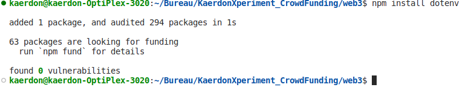
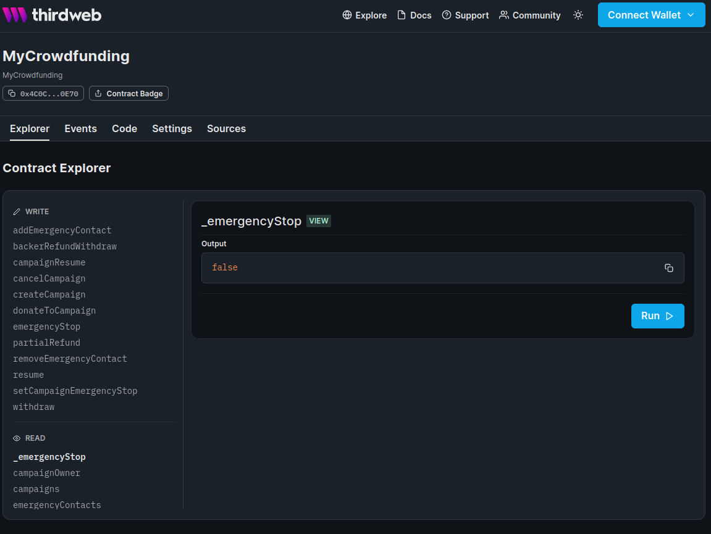
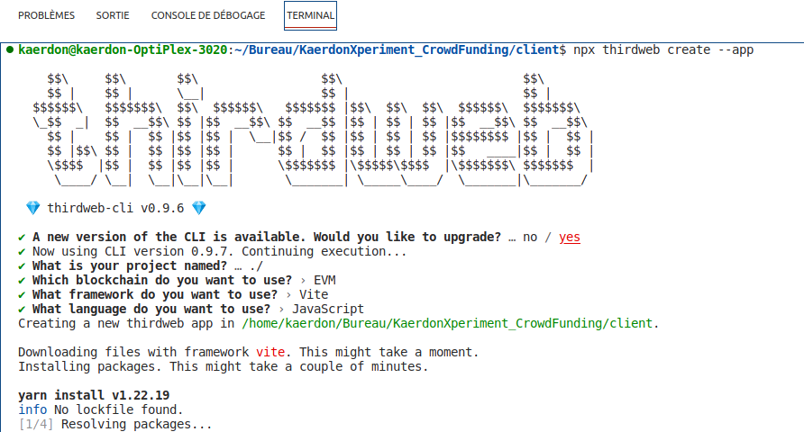
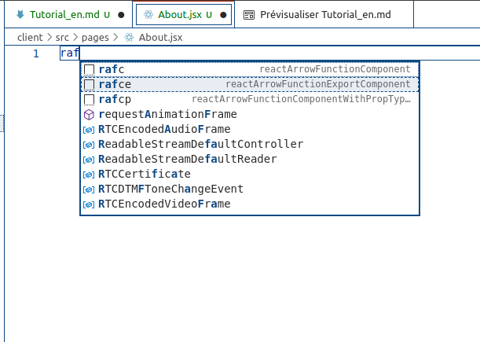

<link rel="stylesheet" href="./myStyle.css">


# Construire une plate-forme de financement participatif Web3 sécurisée et fiable avec QuickNode, Solidity, Orbis Protocol et Krebit protocol et passeport de réputation

#### you can also read this tutorial in English here: [Building a secure and trustworthy Web3 Crowdfunding Platform with QuickNode, Solidity, Orbis Protocol and Krebit protocol and reputation passport](./Tutorial_en. md "English version")

## Introduction

Bienvenue dans ce didacticiel sur la création d'une plate-forme de financement participatif Web3 sécurisée et fiable à l'aide de QuickNode, React, Solidity, du protocole Orbis et du protocole krebit.

Dans ce didacticiel, vous apprendrez à créer une application Web3.0 à part entière qui permet aux utilisateurs d'envoyer des transactions via la blockchain pour soutenir les campagnes de financement participatif. Nous utiliserons React pour créer l'interface de la plate-forme et Solidity pour rédiger des contrats intelligents sur le réseau Ethereum qui gèrent les fonctionnalités Web3. Pour connecter la plateforme au réseau Ethereum, nous utiliserons QuickNode. De plus, nous utiliserons le protocole Orbis pour ajouter des fonctionnalités sociales telles qu'un fil d'actualité, une messagerie et la possibilité de suivre d'autres utilisateurs.

Pour assurer la sécurité et la réputation de notre plateforme et de ses utilisateurs, nous mettrons également en œuvre le protocole W3C Verifiable Credentials by krebit.id et le krebit Reputation Passport. Ces outils nous permettront de valider les créateurs de campagnes et d'utiliser des identifiants vérifiables pour garantir l'intégrité de notre plateforme.

Je suis ravi de vous guider dans l'utilisation de ces outils et technologies pour créer une plate-forme sécurisée et fiable qui comprend également des fonctionnalités sociales. Commençons ensemble à créer une incroyable plateforme de financement participatif web3 !

**** J'espère que vous êtes aussi impatient que moi de commencer ce tutoriel ! Plongeons-nous et commençons à construire notre plateforme de financement participatif Web3.****


### Pourquoi une plateforme de crowdfunding web3 ?
* Décentralisation : Les plateformes Web3 sont décentralisées, ce qui signifie qu'elles ne sont pas contrôlées par une seule entité ou autorité. Cela peut aider à garantir que la plate-forme est équitable et transparente, car les décisions sont prises par consensus plutôt que par une autorité centralisée.

* Sécurité : les plates-formes Web3 peuvent être plus sécurisées que les plates-formes traditionnelles, car elles utilisent la technologie blockchain pour stocker et sécuriser les données. Cela peut aider à prévenir la fraude et la falsification, qui peuvent être un problème avec les plateformes traditionnelles.

* Accessibilité : les plates-formes Web3 sont accessibles à toute personne disposant d'une connexion Internet, ce qui signifie qu'elles peuvent être utilisées par un plus large éventail de personnes que les plates-formes traditionnelles qui peuvent être limitées à certaines régions ou pays.

* Inclusivité : les plates-formes Web3 peuvent également être plus inclusives, car elles peuvent permettre aux utilisateurs de participer en utilisant une variété de méthodes de paiement Web3 telles que les crypto-monnaies. Cela peut permettre aux personnes qui n'ont pas accès aux services financiers traditionnels de participer plus facilement aux campagnes de financement participatif.

* Transparence : les plates-formes Web3 peuvent également être plus transparentes, car elles utilisent la technologie blockchain pour suivre et enregistrer les transactions. Cela peut permettre aux utilisateurs de voir plus facilement comment leurs dons sont utilisés et peut aider à renforcer la confiance au sein de la communauté.

#### Pourquoi un passeport de réputation ?

* Sécurité : l'un des principaux avantages de l'utilisation d'un passeport de réputation est qu'il peut contribuer à garantir la sécurité de la plate-forme. En vérifiant l'identité et la réputation des créateurs de campagnes, les utilisateurs peuvent être sûrs qu'ils soutiennent des campagnes légitimes et qu'ils ne sont pas victimes d'escroqueries ou de fraudes.

* Fiabilité : un passeport de réputation peut également aider à renforcer la confiance au sein de la communauté en permettant aux utilisateurs de voir la réputation et les commentaires des autres utilisateurs. Cela peut aider les utilisateurs à prendre des décisions éclairées sur les campagnes à soutenir et peut encourager davantage de personnes à participer à la plateforme.

* Incitations : un passeport de réputation peut également inciter les créateurs de campagne à se comporter de manière éthique et à maintenir une bonne réputation.
   Cela peut aider à garantir que les campagnes sont menées de manière équitable et transparente, ce qui peut encore renforcer la fiabilité de la plateforme.

* Communauté : une plate-forme de financement participatif Web3 avec des fonctionnalités sociales peut aider à créer un sentiment de communauté parmi les utilisateurs, ce qui peut être un atout précieux pour les créateurs de campagnes et les donateurs. En permettant aux utilisateurs de se connecter les uns aux autres et de discuter de leurs campagnes, la plateforme peut devenir un centre d'activité et d'engagement.

***Globalement, construire une plateforme de crowdfunding web3 avec un passeport de réputation peut être une bonne chose car elle peut offrir un environnement décentralisé, sécurisé, accessible, inclusif, fiable, social et transparent pour les activités de crowdfunding.
Cela peut contribuer à rendre le financement participatif plus efficace, à renforcer la confiance dans la plateforme et à encourager davantage de personnes à participer, ce qui peut finalement conduire à des campagnes plus réussies et à une communauté plus forte.***

## Conditions préalables
1. Compréhension de base des concepts de développement Web tels que HTML, CSS et JavaScript.

2. Expérience avec React : aucune car nous partons de zéro, mais il peut être utile de se familiariser avec ce cadre.

3. Expérience avec Solidity : vous devrez peut-être vous familiariser avec ce langage de programmation.

4. Expérience avec le terminal : certaines parties du didacticiel peuvent impliquer l'utilisation de la ligne de commande pour installer des dépendances ou exécuter des commandes, vous devrez donc peut-être vous familiariser avec.

## Configuration de votre environnement de développement

Avant de commencer, nous devons configurer notre environnement de développement.
### QuickNode
Tout d'abord, nous utiliserons QuickNode pour créer un nœud Ethereum en quelques clics.
Cela nous donnera accès à l'evm et aux réseaux Ethereum et à toutes ses fonctionnalités.

QuickNode est un service qui vous permet de faire tourner un nœud en quelques clics. C'est un excellent moyen de démarrer avec le développement d'Ethereum, car il vous permet de configurer rapidement un nœud et de commencer à créer votre application sans avoir à vous soucier de configurer un nœud from zéro (ce qui prend du temps et des ressources).
Pour créer un nœud, vous devez créer un compte sur QuickNode, puis créer un nœud pour le réseau de votre choix, ils peuvent vous aider avec au moins 16 chaînes de blocs différentes au moment d'écrire ces lignes.

Démarrez votre QuickNode en quelques secondes et accédez à plus de 16 chaînes différentes. Leur réseau multi-cloud distribué à l'échelle mondiale et à mise à l'échelle automatique vous transportera du MVP jusqu'à l'entreprise. [Inscription QuickNode](https://www.quicknode.com/signup "QuickNode")

```
MVP signifie Minimum Viable Product. Dans ce contexte, il fait référence à une étape du processus de développement où le produit possède l'ensemble minimum de fonctionnalités nécessaires pour être fonctionnel et peut être utilisé pour tester et valider le concept avec des clients potentiels. L'idée est de mettre le produit sur le marché le plus rapidement possible afin de recueillir des commentaires et d'itérer sur le produit avant d'investir trop de temps et de ressources dans le développement. L'objectif est d'amener le produit au point où il peut être utilisé pour démontrer sa valeur et attirer des financements ou des clients.
```

### EDI recommandé
Je recommande d'utiliser VS Code comme IDE. Il s'agit d'un éditeur de code open source léger, facile à utiliser et doté de nombreuses fonctionnalités utiles. Il possède également de nombreuses extensions qui peuvent vous aider dans votre développement, telles que Solidity et React.

### la structure de base de notre projet
nous utiliserons la structure suivante pour notre projet :
co nous créons le dossier Crowdfunding_tutorial et à l'intérieur nous créons les dossiers client et web3. Le dossier client contiendra le frontend de notre application, et le dossier web3 contiendra les contrats intelligents et le backend de notre application.


```
=> Crowdfunding_tutoriel
   => cliente
   => web3
    
```
### démarrage de l'application

ouvrez le dossier crowdfunding_tutorial dans VS Code et ouvrez un nouveau terminal.


dans le terminal au niveau racine de votre projet, lancez la commande suivante pour créer le smart contract de notre application :

```bash
npx thirdweb@latest créer --contract
```


et vous pouvez faire différentes commandes comme celle-ci :


maintenant nous avons quelques fichiers dans notre dossier web3, regardons-les :


Vous pouvez commencer à éditer la page en modifiant contracts/Contract.sol.

Pour ajouter des fonctionnalités à vos contrats, vous pouvez utiliser le package @thirdweb-dev/contracts qui fournit des contrats de base et des extensions à hériter. Rendez-vous sur thirdweb [Contracts Extensions Docs](https://portal.thirdweb.com/contractkit) pour en savoir plus.

comme nous devons gérer des données sensibles dans notre contrat intelligent, nous utiliserons le package dotenv pour stocker notre clé privée et notre phrase mnémonique dans un fichier .env.
  
   ```bash
   $npm install dotenv
   ```
   


nous commençons et renommons le fichier contracts/Contract.sol en contracts/MyCrowdfunding.sol et nous allons commencer à l'éditer.
nous utilisons [https://docs.soliditylang.org/en/v0.8.17/introduction-to-smart-contracts.html](https://docs.soliditylang.org/en/v0.8.17/introduction-to- smart-contracts.html) comme référence pour solidity.

### économiser de l'essence
Et nous avons à cœur que nos utilisateurs puissent créer des campagnes, faire des dons aux campagnes et retirer des fonds des campagnes, sans payer trop d'essence.
Parce que programmer en solidité n'est pas vraiment comme programmer dans d'autres langages, nous allons commencer par les bases, puis nous ajouterons plus de fonctionnalités à notre contrat intelligent. certaines parties du code seront revisitées plus tard dans le tutoriel, à des fins d'optimisation.
mais une chose que nous pouvons faire maintenant est de penser à la structure de données que nous devrons stocker dans notre contrat intelligent.

Parce que nous aurons besoin de stocker les données de nos campagnes, nous devons créer une structure, et nous l'appelons Campagne.
et voici la première façon d'optimiser notre code, nous allons utiliser ce qu'on appelle un emballage serré, ce qui signifie que nous allons utiliser le plus petit type de données possible pour chaque variable, et les empiler dans le bon ordre pour économiser du gaz.

la longueur d'emplacement par défaut dans solidty est de 32 octets et l'unité de mémoire et de stockage par défaut est de 32 octets.
dans un emplacement de 32 octets, nous pouvons enregistrer un uint256, qui est le plus grand type entier en termes de solidité, mais nous pouvons également enregistrer 8 uint32, 4 uint64, 2 uint128 ou 1 uint256.
Ainsi, un uint8 fait 1 octet, un uint16 fait 2 octets, un uint32 fait 4 octets, un uint64 fait 8 octets, un uint128 fait 16 octets, un uint160 fait 20 octets et un uint256 fait 32 octets.

Réfléchir un peu à la valeur que nous devons stocker et à la gamme qu'ils peuvent avoir, nous aidera à réduire au maximum les frais, c'est aussi une compétence précieuse à avoir lorsque vous programmez de manière solide.


la première variable est une adresse du propriétaire de la campagne.

Une adresse en solidité est une variable de 20 octets qui est un uint160, cela signifie qu'il faudra 20 octets de mémoire de stockage dans un slot de 32 octets, car l'unité de base de mémoire et de stockage en solidité est de 32 octets. afin que le compilateur puisse emballer intelligemment les données dans le bon ordre pour économiser du gaz.

Il le fait en complétant l'emplacement de 32 octets avec 0, donc l'adresse prendra 20 octets et les 12 autres octets seront 0 ou nous pouvons utiliser les 12 octets pour stocker d'autres variables. et nous le ferons. simplement en déclarant le bon type et en les emballant dans le bon ordre.
économiser de l'espace dans le stockage dans la solidité est vraiment important, car cela permettra d'économiser du gaz pour l'utilisateur.

La première chose que nous allons faire est de déclarer une variable de type adresse pour contenir l'adresse du propriétaire de la plateforme, qui sera l'administrateur de la plateforme.

dans le fichier MyCrowdfunding.sol nous ajouterons le code suivant :

```javascript
// adresse du propriétaire de la plateforme admin de la plateforme
     adresse publique platformPropriétaire ;
```
puis nous déclarons la structure de la campagne qui contiendra toutes les données de la campagne.
la variable du propriétaire de la campagne sera de type adresse et contiendra l'adresse du propriétaire de la campagne (20 octets sur 1 emplacement de 32 octets).

```javascript 
// SPDX-License-Identifier: GPL-3.0
pragma solidity ^0.8.17;

/**
 * @title MyCrowdfunding
 * @author Timothee de Almeida < [tim@1proamonservice.eu] >
 * @dev Implements crowdfunding platform
 * @dev This contract is a simple crowdfunding platform where users can create campaigns and other users can donate to them.
 * 
 */

contract MyCrowdfunding {
    // platform owner address admin of the platform
    address public platformOwner;
    // campaign structure which holds the campaign data
    struct Campaign {
        // campaign owner address (20 bytes of 1 slot of 32 bytes)
        address owner;
        // an uint64 is enough to store a timestamp until the year 584554 so it does take 8 bytes of 1 slot of 32 bytes
        uint64 deadline;  
       // campaign status
        // 0 - draft
        // 1 - active
        // 2 - completed
        // 3 - cancelled
        // 4 - withdrawn
        // 5 - refunded
        // 6 - expired
        //a uint8 is enough to store a status code, it takes 1 byte of 1 slot of 32 bytes
        uint8 status;
        // here we have used 1 slot so far and we have 3 byte left in the slot to store another variable.

        // from now we are using 1 slot per variable.
        uint256 target;        
        uint256 amountCollected;
        // backers array is a dynamic array of addresses  and backersDonations is a dynamic array of uint256    
        address[] backers;
        uint256[] backersDonations;

        string image;
        string title;
        string description;        
    }
    // mapping of campaign IDs to campaign data
    mapping(uint => Campaign) public campaigns;
    // number of campaigns
    uint public numberOfCampaigns;
    
    //basic functions
    constructor() {
        platformOwner = msg.sender;
    }
    //@dev create a new campaign, will be called by the campaign owner and will be revisited later
    function createCampaign (address _owner, string memory _title, string memory _description, uint256 _target, uint256 _deadline, string memory _image)  public returns (uint256) {
        Campaign storage campaign = campaigns[numberOfCampaigns];
        // we have to use storage here because we are modifying the campaign data
        // we check if deadline is in the future
        require(_deadline > block.timestamp, "Deadline must be in the future");
        
        campaign.owner = _owner;
        campaign.deadline = uint64(_deadline);
        campaign.status = 1;
        campaign.target = _target;
        campaign.amountCollected = 0;
        campaign.image = _image;
        campaign.title = _title;
        campaign.description =_description;                               
        numberOfCampaigns++;
        return numberOfCampaigns-1;
    }
    
    function donateToCampaign (uint256 _id) public payable {
        uint256 amount= msg.value;
        Campaign storage campaign = campaigns[_id];
        
        

        (bool success, ) = payable(campaign.owner).call{value: amount}("");
        if (success) {
            //@dev only if payment is successful we add the donator and donations to the campaign and update the amount collected
            campaign.backers.push(msg.sender);
            campaign.backersDonations.push(amount);
            campaign.amountCollected = campaign.amountCollected+amount;
        } else {
            revert("Transfer failed.");
        }
    }
    
    function getDonators (uint256 _id) view public returns (address[] memory, uint256[] memory) {
        Campaign storage campaign = campaigns[_id];
        return (campaign.backers, campaign.backersDonations);
    }

      
    
    function getCampaigns () public view returns (Campaign[] memory)  {
        Campaign[] memory allCampaigns = new Campaign[](numberOfCampaigns);
        for (uint i=0; i<numberOfCampaigns; i++) {
            Campaign storage item = campaigns[i];
            allCampaigns[i] = item;
        }
        return allCampaigns;
    }


}

```

C'est le strict minimum pour notre contrat, nous ajouterons plus de fonctions plus tard.
pour l'instant nous allons expérimenter la puissance de thirdweb et déployer facilement notre contrat sur le testnet.

## Déployer le contrat sur le testnet

1) dans le dossier web3 créez un nouveau fichier nommé .env et ajoutez le code suivant :

```javascript
PRIVATE_KEY=votre clé privée

```
Pour obtenir cette clé privée, ouvrez le métamasque et cliquez sur l'icône des détails du compte, puis cliquez sur le bouton exporter la clé privée.

2) ajouter à ce fichier l'url quicknode de votre tableau de bord
  créez un point de terminaison ethereum goerli testnet et copiez l'url.
  copiez-le dans le fichier .env et ajoutez-le à la fin de l'url comme ceci :
```javascript
PRIVATE_KEY=votre clé privée
QUICKNODE_URL=votre URL de nœud rapide
```


et allez dans le fichier hardhat.config.js et ajoutez l'url à la section réseaux que nous allons créer.

```javascript
defaultNetwork='goerli',
réseaux :{
     casque:{},
     goerli :{
         URL:process.env.QUICKNODE_URL,
         comptes :[process.env.PRIVATE_KEY]
     }
},

```

Et voilà, nous avons notre contrat prêt à être déployé sur le testnet.
alors faisons-le. dans le terminal allez dans le dossier web3 et lancez la commande suivante :

```bash
npm exécuter le déploiement
```


Après cela, cliquez simplement sur le lien pour voir confirmer la transaction dans le métamasque. il apparaîtra deux fois, cliquez sur accepter sur les deux.
peu de temps après, vous verrez l'adresse du contrat et un tableau de bord avec les détails du contrat.



nous reviendrons plus tard sur le contrat intelligent et y ajouterons plus de fonctions.
pour l'instant, créons une application react pour interagir avec le contrat.

## Création d'une application de réaction
Dans le terminal, accédez au dossier client.

   ```bash
   $ cd ../client
   ```


Dans le terminal, exécutez la commande suivante pour créer une nouvelle application Vite dans le dossier client :
  
   ```bash
   $ npx thirdweb créer --app
   ```



Un dernier élément à ajouter est le package react-router-dom. Ce package nous permettra de naviguer entre les pages de notre application. Pour ajouter ce package, exécutez la commande suivante dans le terminal :

   ```bash
   $ npm installez réagissez-routeur-dom
   ```
Exécutez maintenant la commande suivante pour démarrer le serveur de développement :

   ```bash
   $ fil dev
   puis cliquez sur le lien qui apparaît dans le terminal pour ouvrir l'application dans votre navigateur.
     http://localhost:5173/
   ```


faites ctrl+c dans le terminal pour arrêter le serveur.

Bonne nouvelle, notre application React est prête à être stylisée et à interagir avec le contrat intelligent, mais comme nous l'avons créée from zéro, dans le terminal, nous exécuterons la commande suivante pour y supprimer tous les fichiers :

   ```bash
   $ rm -rf * && rm -rf .*
   ```

puis nous allons créer notre premier fichier dans le dossier src appelé main.jsx, c'est le fichier principal de notre application de réaction, dans le type de terminal.

   ```bash
   $ touch main.jsx
   ```
   

alors ajoutons-y du code.

```javascript
import React from'react' ;
import ReactDOM from'react-dom' ;
import { BrowserRouter as Router } from 'react-router-dom' ;
import { ChainId, DAppProvider } de '@thirdweb-dev/react' ;
```

### Ajout du CSS Tailwind
Nous utiliserons Tailwind CSS pour styliser notre application. Tailwind CSS est un framework CSS utilitaire qui vous permet de créer rapidement des conceptions personnalisées sans avoir à écrire de CSS. C'est un excellent outil pour créer des applications Web car il est léger, facile à utiliser et possède de nombreuses fonctionnalités utiles.
vous pouvez en savoir plus sur tailwind css [ici](https://tailwindcss.com/docs/guides/create-react-app "tailwindcss")

Pour ajouter Tailwind CSS à notre projet, nous exécuterons la commande suivante dans le terminal :

```bash
$ npm install -D tailwindcss préfixe automatique postcss
$ npx tailwindcss init -p

```


Cela créera un fichier tailwind.config.cjs dans le répertoire racine de notre projet. Ce fichier contient la configuration pour Tailwind CSS. Nous devrons ajouter la ligne suivante au fichier :

```
module.exports = {

   teneur: [
 
     "./src/**/*.{js,jsx,ts,tsx}",
 
   ],
 
   thème: {
 
     étendre: {},
 
   },
 
   plugins : [],
 
  }
```

maintenant dans le dossier src de votre fichier index.css remplacez le contenu par la ligne suivante comme indiqué dans la documentation de tailwindcss :

``` CSS
@base de vent arrière ;
@composants tailwind ;
utilitaires @tailwind ;

```
Et enfin nous devons import ce fichier dans le fichier main.jsx, donc dans le fichier main.jsx ajouter la ligne suivante :

```javascript
import './index.css' ;
```

vous pouvez maintenant aller dans le dossier src et ouvrir le fichier App.js et remplacer le contenu par le code suivant :

```javascript
import { useState } de 'réagir'

const App = () =>{
   const [count, setCount] = useState(0)

   retour (
     <div className="App">
      <h1 className="text-xl font-bold underline">
       Bonjour le monde!
     </h1>
     </div>
   )
}

exporter l'application par défaut


```
  enregistrez le fichier et revenez au terminal et exécutez la commande suivante pour démarrer le serveur de développement :

```bash
$ npm run dev
```
ouvrez le lien dans le navigateur et vous verrez le résultat suivant :


Comme nous le voyons, le texte en gras et souligné est celui que nous avons ajouté dans le fichier App.js. et si nous voyons l'effet gras et souligné, cela signifie que tailwindcss fonctionne.

Nous pouvons maintenant ajouter le dossier assets dans le dossier src et ajouter les fichiers téléchargés from ce [lien ici](./files/assets.zip "assets")

Ce sont des exemples d'images et d'icônes que nous utiliserons dans notre application, vous pouvez ajouter les vôtres.

Maintenant, dans le terminal du dossier src, nous ajoutons un autre dossier nommé constants et nous y ajoutons un fichier appelé index.js et nous ajoutons le code suivant :

```javascript

import { createCampaign, tableau de bord, déconnexion, paiement, profil, retrait } de '../assets' ;

exporter les liens de navigation const = [
   {
     nom : 'tableau de bord',
     imgUrl : tableau de bord,
     lien: '/',
   },
   {
     nom : "campagne",
     imgUrl : créer une campagne,
     lien : '/créer-campagne',
   },
   {
     nom : 'paiement',
     imgUrl : paiement,
     lien: '/',
     désactivé : vrai,
   },
   {
     nom : 'retirer',
     imgUrl : retirer,
     lien: '/',
     désactivé : vrai,
   },
   {
     nom : 'profil',
     imgUrl : profil,
     lien : '/profil',
   },
   {
     nom : 'déconnexion',
     imgUrl : déconnexion,
     lien: '/',
     désactivé : vrai,
   },
] ;

```

Il s'agit principalement de la barre de navigation de notre application, nous ajouterons la barre de navigation dans une prochaine étape.
nous ajoutons maintenant quelques dossiers supplémentaires dont nous aurons besoin dans le dossier src, créons le contexte, les composants, les pages et les dossiers utils.
Pour l'instant, nous allons ajouter du contexte à notre application, ce qui nous permet de partager des données entre les composants sans avoir à transmettre manuellement les accessoires à tous les niveaux, et cela nous permet d'utiliser le sdk thirdweb dans toutes les parties de notre application.
pour créer ces dossiers dans le dossier src du terminal tapez :

```bash
mkdir contexte composants pages utilitaires
```
Dans le dossier utils, nous ajoutons un fichier appelé index.js et nous ajoutons le code suivant :

```javascript

export const daysLeft = (délai) => {
  
   différence const = new Date(date limite).getTime()- (Math.floor(Date.now() / 1000)); //
  
   const jours restants = différence / (3600 * 24);

   renvoie les jours restants.toFixed(0);
} ;

  
   export const calculateBarPercentage = (but, raiseAmount) => {
     pourcentage const = Math.round((raisedAmount * 100) / goal);
  
     pourcentage de retour ;
   } ;
  
   export const checkIfImage = (url, rappel) => {
     const img = nouvelle Image();
     img.src = url;
  
     si (img.complet) rappel (vrai);
  
     img.onload = () => rappel (vrai);
     img.onerror = () => rappel (faux);
   } ;
  

```
Ce sont quelques fonctions que nous utiliserons dans notre application, rien de spécial ici.
nous passons maintenant à notre fichier app.jsx dans le dossier src et nous ajoutons le code suivant :

```javascript
import { useState } de 'réagir' ;
import {Route,Routes} from'react-router-dom' ;
import { BrowserRouter as Router} from 'react-router-dom' ;

```

alors nous pouvons créer notre wrapper div que nous allons styliser en utilisant Tailwind CSS.
Tailwind CSS est un outil extrêmement utile pour styliser rapidement vos sites Web et vos applications. Il vous donne un tas de classes utilitaires de bas niveau que vous pouvez mélanger et assortir pour créer l'apparence que vous voulez. De plus, il est vraiment facile de personnaliser et de créer le vôtre !

C'est un changeur de jeu pour rationaliser votre processus de style et rendre vos projets géniaux.
à tout moment, vous pouvez vous référer à la documentation de tailwindcss [ici](https://tailwindcss.com/docs "tailwindcss documentation") et rechercher (ctrl+k ouvrir la recherche ou le champ de recherche) pour la classe que nous utilisons dans le code sous.


alors ajoutez ceci après les instructions d'importation dans la fonction const App = () =>{} :

```javascript
const App = () =>{
 
   retour (
     <div className="relative sm:-8 p-4 bg-primary min-h-screen flex flex-row">
      <div className="sm:flex caché mr-10 relatif">
       Barre latérale
      </div>
      <div className="flex-1 max-sm:w-full max-w-[1280px] mx-auto sm:pr-5 " >
         Barre de navigation
      </div>
     </div>
   )
}

exporter l'application par défaut

```
le code ci-dessus est le wrapper div de notre application, nous ajouterons la barre latérale et la barre de navigation dans les prochaines étapes.
mais nous devons ajouter des informations au fichier tailwind.config.js dans le dossier racine de notre projet. alors ouvrez le fichier et remplacez la section theme par le code suivant :

```javascript
  thème: {
     couleurs: {
       primaire : '#0035c5',
       secondaire : '#1E88e5',
       troisième : '#81c8ee',
       quatrième : '#ede8e4',
       cinquième : '#8a8381',
       sixième:'#c8c7c9',
       septième:'#c1afa8',
     },
  

```
donc non, nous devons ajouter un itinéraire à notre application
donc dans le fichier app.jsx du dossier src nous ajoutons le code suivant après la barre de navigation sous le mot à l'intérieur de la même div
nous allons également modifier le code pour Navbar et Sidebar regardez le code ci-dessous :

```javascript

const App = () =>{
 
   retour (
     <div className="relative sm:-8 p-4 bg-primary min-h-screen flex flex-row">
      <div className="sm:flex caché mr-10 relatif">
       <Barre latérale />
      </div>
      <div className="flex-1 max-sm:w-full max-w-[1280px] mx-auto sm:pr-5 " >
         <Barre de navigation />

       <Itinéraires>
         <Route path="/" element={<Accueil />} />
         <Route path="/about" element={<About />} />
       </Routes>
      </div>
     </div>
   )
}
 
```
si vous jetez un coup d'œil sur le site Web pour l'instant, ce serait une erreur car nous n'avons pas encore ajouté les composants et les pages.

vous pouvez créer les pages et les fichiers de composants dans le dossier pages et composants respectivement.
Donc, dans le dossier des composants, nous ajoutons un fichier appelé Navbar.jsx et Sidebar.jsx
et au dossier des pages, nous ajoutons ces fichiers appelés Home.jsx, About.jsx, CreateCampaign.jsx, CampaignDetails.jsx et Profile.jsx

C'est le moment idéal pour parler d'une extension vscode qui nous aidera beaucoup dans notre projet et d'autres projets de développement.
cette extension est des extraits es7 React/js.
cette extension est une collection d'extraits de code React, Redux et Graphql pour les syntaxes ES7 et ES6.
pour installer cette extension dans vscode nous pouvons utiliser le raccourci
Lancez l'ouverture rapide :

Linux : Ctrl+P
macOS : ⌘P
Fenêtres : Ctrl+P
Collez la commande suivante et appuyez sur Entrée :
```
ext installer dsznajder.es7-react-js-snippets
```
vous pouvez trouver plus d'informations à ce sujet ici [es7 React/js snippets](https://marketplace.visualstudio.com/items?itemName=dsznajder.es7-react-js-snippets "es7 React/js snippets")


Ensuite, dans chacun de ces fichiers, nous utilisons l'extrait suivant de cette extension d'extrait pour créer la structure de base du composant ou de la page.

```javascript
Rafce
```

sélectionnez-le et développez-le immédiatement dans le code suivant :


comme nous avons la structure de base de notre application, nous pouvons maintenant créer un dernier fichier dans ces deux dossiers, composants et pages, nous appelons donc ce fichier index.js
dans le dossier pages nous ajoutons le code suivant :

```javascript
exporter {default as Home} from'./Home' ;
exporter {default as Profile} from'./Profile' ;
exporter {default as CreateCampaign} from'./CreateCampaign' ;
exportez {default as CampaignDetails} from'./CampaignDetails' ;
exporter {default as About} from './About' ;

```
et dans le dossier des composants, nous ajoutons le fichier index.js avec le code suivant :

```javascript
exporter {default as Sidebar} from './Sidebar' ;
exporter {default as Navbar} from './Navbar' ;

```
Nous pouvons maintenant import ces fichiers dans le fichier App.jsx du dossier src et ajouter au code que nous avons créé avant le code suivant dans la section ipmport :

```javascript
import {barre latérale, barre de navigation} from './components'
import {Home, About, CreateCampaign, CampaignDetails, Profile} from './pages' ;

```

